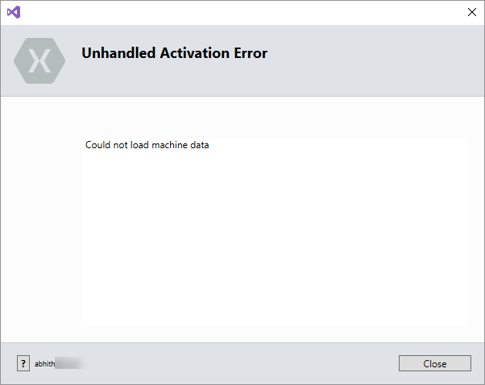

# DRAFT : [Could not load machine data - Xamarin](post url)
## Post Attributes
### Tags
Xamarin
### Categories
Xamarin
### Excerpt
Xamarin account login error on visual studio : Could not load machine data.
### Published Date

## Content
### Markdown
I have a side project, [piggyvault](http://piggyvault.in) aka piggy, which is basically my personal finance management app. Have a web application for the same as well as a mobile app built using Ionic, specifically Ionic 3.

First did it on Ionic 1,then upgraded to 2 and now it is running on Ionic 3. People have a tendency to get bored, so when I get bored I tried to build an app for my piggy using Xamarin.

Initially tried Xamarin.Android, it was tough though. I didn't had any previous experience in xaml. Once I completed a CRUD module in Xamarin.Android, found the evolve app built using Xamarin.Forms and I was pretty impressed.

So, stopped Xamarin.Android and cloned evolve app and did implemented few of my app features in the Xamarin.Form version and it running smooth.

But recently I switched my dev machine. And now facing two problem related to Xamarin development.
- First one, the already working solution not building in the new machine,
- Secondly, Couldn't able to sign into my xamarin account from visual studio 17 preview.

And am stuck.

Hoping to find solutions for both.

Hoping is a bad idea, trying is a good idea.

Trying...

## Image
### Post Image
 
### Post Header Image

## Meta Tags
### Social Description

