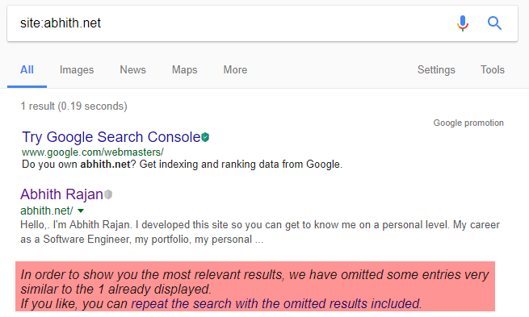
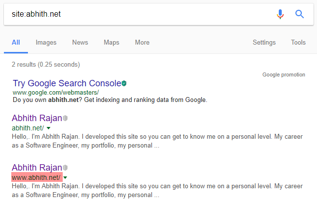

# [Redirect non-www urls to www urls](https://www.abhith.net/post/redirect-non-www-urls-to-www-urls/)
## Post Attributes
### Tags
IIS, SEO, Umbraco, Web.Config
### Categories
IIS, Umbraco, My-Daily-Google
### Excerpt
When considering SEO, either you have to stick with www versioned url or non-www URLs. Having both accessible for a domain is a bad practice.
### Published Date

## Content
When considering SEO, either you have to stick with www prefixed url or non-www urls. Having both accessible for a domain is a bad practice.

After I setup my website, when I checked google for my site status, it was like below, 

 

If you wonder why I searched like site:mydomain on google, this will list all the search results under the domain we specified.

See the highlighted section. If we search again to see the omitted results. We will see search result like this,



As you can see, both the url get indexed and one is omitted since it isn't relevant.

So what next,

You have to choose which pattern you gonna stick to. I initially thought to go with non-www but then read the article SETTING UP UMBRACO TO ALWAYS USE WWW LINKS and decided to go with www. 

And to redirect non-www to www version, I added the rewrite rule as mentioned in the article. My Code look like this,
```xml
<system.webServer>
    <rewrite>
      <rules>
        <clear />
        <rule name="Redirect Non WWW" stopProcessing="true" xdt:Transform="Insert">
          <match url=".*" />
          <conditions>
            <add input="{HTTP_HOST}" pattern="^(?!www)(.*)$" />
          </conditions>
          <action type="Redirect" redirectType="Permanent" url="https://www.{C:1}/{R:0}" />
        </rule>
      </rules>
    </rewrite>
  </system.webServer>
  ```
 Noticed the xdt:Transform="Insert" in the line,
```
<rule name="Redirect Non WWW" stopProcessing="true" xdt:Transform="Insert">
```
That is because I added this rule in my Web.Release.config, Which will add the rule to the Web.config automatically during publishing. The reason for which is explained in one of my article [INSERTING REWRITE RULE IN RELEASE CONFIG](https://www.abhith.net/post/inserting-rewrite-rule-in-release-config/).

 

Cover photo by Luca Bravo

## Image
### Post Image
 
### Post Header Image


## Meta Tags
### Social Description
When considering SEO, either you have to stick with www versioned URL or non-www URLs. Having both accessible for a domain is a bad practice.
