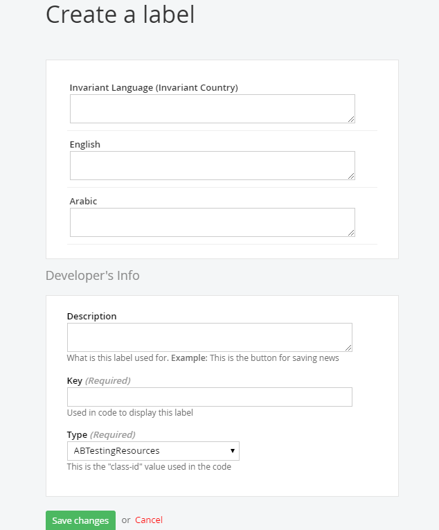

# [Sitefinity : Read localized resource labels in MVC widget](https://www.abhith.net/post/sitefinity-read-localized-resource-labels-in-mvc-widget/)
## Post Attributes
### Tags
MVC, Razor, Sitefinity-Rookie-Guide 
### Categories
Sitefinity 
### Excerpt
Explains how to get localized labels in Sitefinity MVC widgets.
### Published Date
2017-12-07 00:52:55
## Content
### Markdown
In your Razor View,
<pre style="font-family:Consolas;font-size:13;color:gainsboro;background:#1e1e1e;">@Html.Resource(&quot;ResourceLabel&quot;,&nbsp;&quot;ResourceName&quot;)
</pre>

In the above code, replace **ResourceLabel** with the **key** and **ResourceName** with the **type**, you used to create the label in the **Sitefinity** CMS. Make sure **Telerik.Sitefinity.Frontend.Mvc.Helpers** namespace is imported in the view. i.e

<pre style="font-family:Consolas;font-size:13;color:gainsboro;background:#1e1e1e;">@using&nbsp;Telerik.Sitefinity.Frontend.Mvc.Helpers;
</pre>

#### Sample usage 
<pre style="font-family:Consolas;font-size:13;color:gainsboro;background:#1e1e1e;">&lt;li&gt;&nbsp;&lt;a&nbsp;href=&quot;/&quot;&gt;@Html.Resource(&quot;Home&quot;,&nbsp;&quot;PageResources&quot;)&lt;/a&gt;&lt;/li&gt;
</pre>

## Image
### Post Image
 
### Post Header Image

## Meta Tags
### Social Description
Explains how to get localized labels in Sitefinity MVC widgets.
