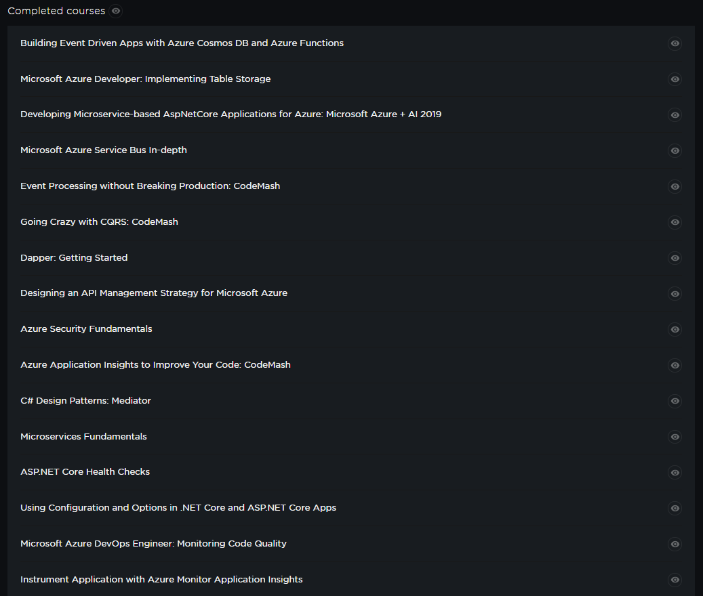
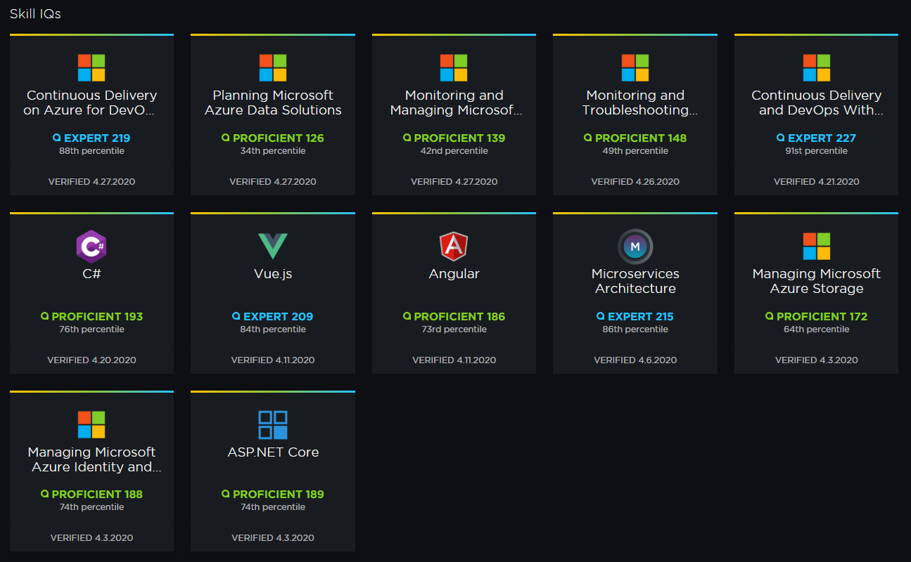
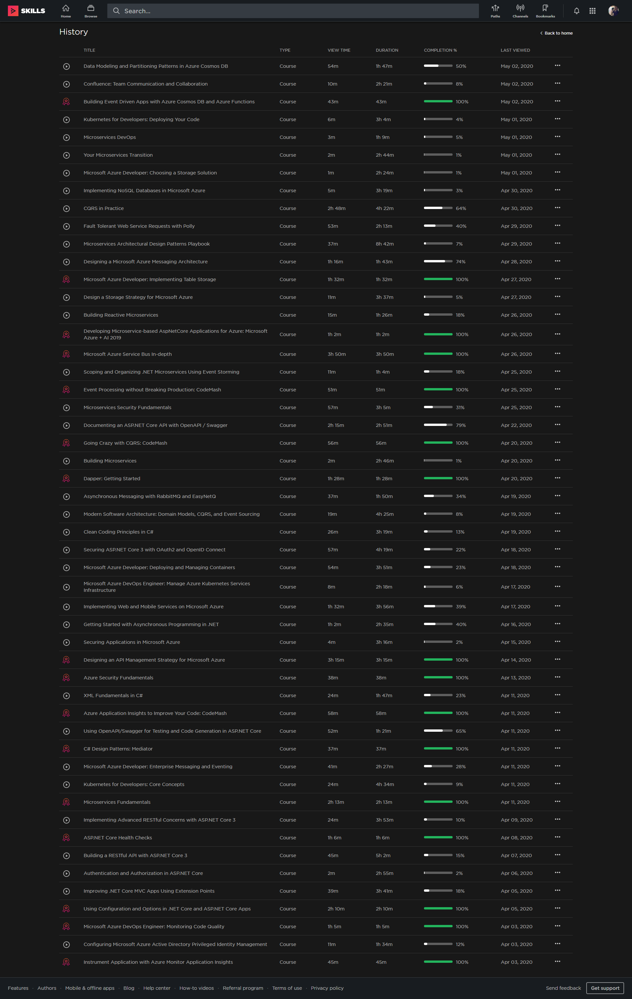
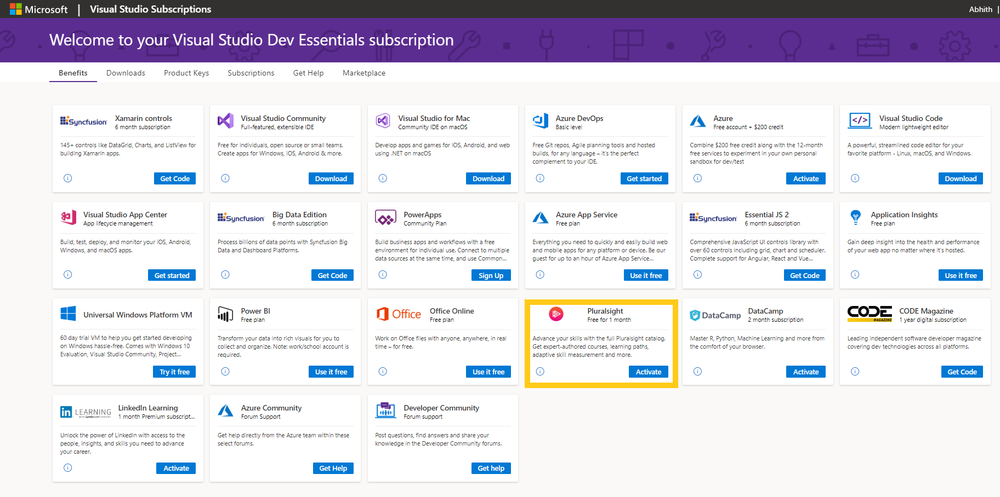

I completed the #FreeApril of Pluralsight and it was very productive. In this one month, I completed around 16 courses, and they are,

And I tested my Skills IQ,

And there are many other courses which I started watching but yet not finished,

Also, you can check my public profile on **Pluralsight**,

:point_right: [Abhith Rajan | Pluralsight Profile](https://app.pluralsight.com/profile/abhith)

## Extending Pluralsight Subscription For Another One Free Month

I extended my **Pluralsight** subscription for one more month by activating the **Visual Studio Dev Essentials** benefit, its **FREE**.

If you don't have an account on **Visual Studio Dev Essentials**, join on the link below, its also free and have many other benefits like shown above,

:point_right: [Visual Studio Dev Essentials](https://visualstudio.microsoft.com/dev-essentials/)

## Discounts

If you have enough budget, you can signup for their paid subscription, and get some **DISCOUNTS** by using my referral,

:point_right: [Pluralsight Referral - Abhith](http://referral.pluralsight.com/mQgi3iP)

## What is the plan, After Subscription Expiry

After this extra free month of Pluralsight, I plan to start the free month of **LinkedIn Learning** and will compare the course quality with **Pluralsight**, then I might switch to a paid plan on either of these two platforms.

I know many companies provide access to these e-learning platforms to their employees, if you are getting such a benefit from your firm, let me know in the comments :point_down:
