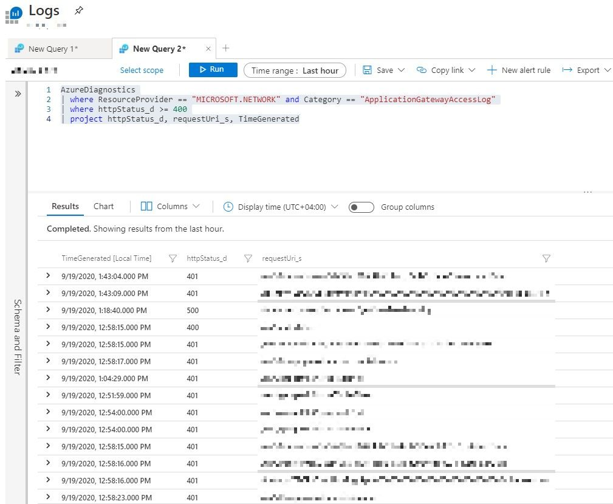
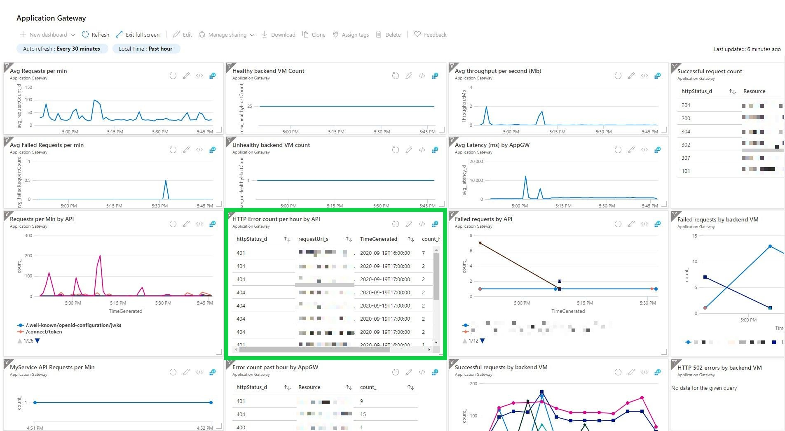
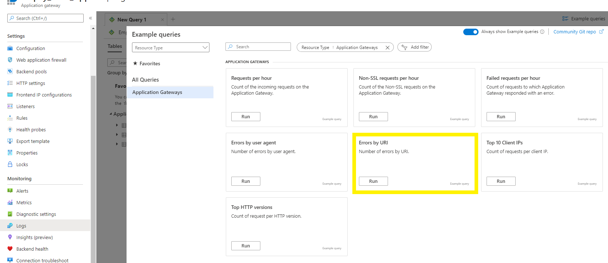

Azure application gateway serves an important role in our infrastructure. All the public inbound traffic happening through Application Gateway.

Part of monitoring, a year ago, I asked the following question in [SO](https://stackoverflow.com/questions/57369646/list-of-failed-requests-in-azure-application-gateway),

"We can see the failed request count in Azure application gateway but how can we see the list of failed requests in the Logs section?
All the logs enabled in Diagnostics settings of Application Gateway.
We need to see at least the requested path (URL) and the response code for the failed requests in the Logs section in the Application Gateway.
Because of the way access log stored in the storage account (folder structure), it is a bit difficult to access the required data through the storage account."

At that time there was no good solution for that. But that changed.

## List of failed requests

```sql
AzureDiagnostics
| where ResourceProvider == "MICROSOFT.NETWORK" and Category == "ApplicationGatewayAccessLog"
| where httpStatus_d >= 400
| project httpStatus_d, requestUri_s, TimeGenerated
```



Also, you can include other fields like `host_s` in the query which will be useful if you have multiple domains configured in the Application Gateway.

You can do much more with the data. In our case, we added a widget to our Azure dashboard where it displays the summary of failed requests per hour. And the query for the same given below,

```sql
AzureDiagnostics
| where ResourceProvider == "MICROSOFT.NETWORK" and Category == "ApplicationGatewayAccessLog"
| where httpStatus_d >= 400
| summarize count(httpStatus_d) by httpStatus_d,requestUri_s, bin(TimeGenerated, 1h)
| order by count_httpStatus_d desc
| project httpStatus_d, requestUri_s, TimeGenerated, count_httpStatus_d
```

And the result looks like (highlighted one),



In fact, Azure made all this easy. When you navigate to the logs section of application gateway, the example queries by default include a similar query,



```sql
// Errors by URI
// Number of errors by URI.
AzureDiagnostics
| where ResourceType == "APPLICATIONGATEWAYS" and OperationName == "ApplicationGatewayAccess" and httpStatus_d > 399
| summarize AggregatedValue = count() by requestUri_s
| sort by AggregatedValue desc
```
