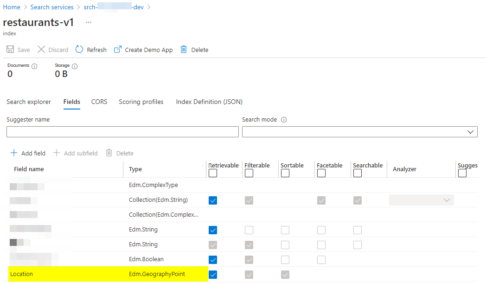
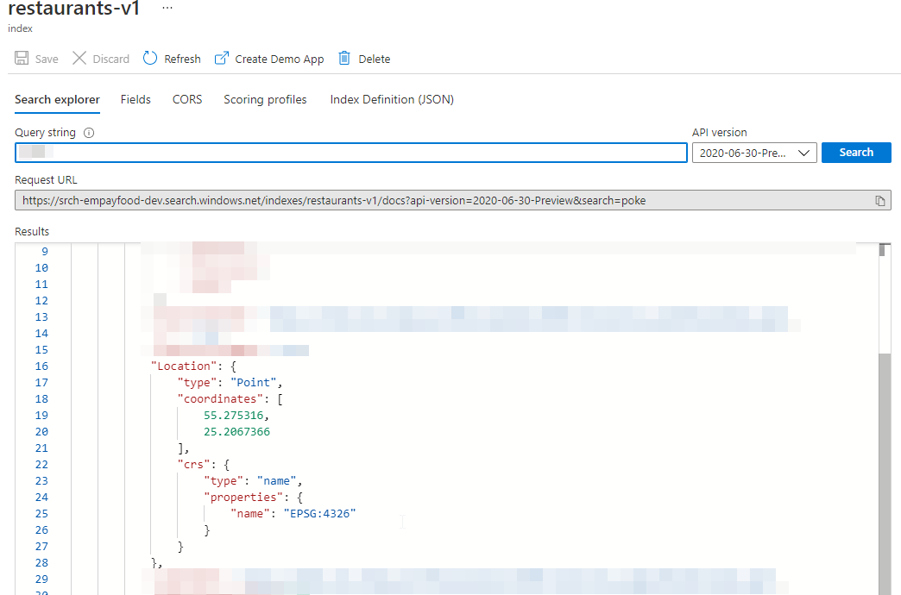

**Azure Cognitive Search Service** supported data types includes `Edm.GeographyPoint`.

While creating index definition using attributes in `C#`, to specify the field type as `Edm.GeographyPoint` we can use the `GeographyPoint` as the type.

```cs
using Azure.Search.Documents.Indexes;
using Microsoft.Spatial;

public class RestaurantIndexModel
{
    ...

    [SimpleField(IsFilterable = true, IsSortable = true)]
    public GeographyPoint Location { get; set; }

    ...
}
```

We need to have the NuGet package `Microsoft.Spatial` to use the `GeographyPoint` type.

```xml
  <PackageReference Include="Microsoft.Spatial" Version="7.8.3" />
```

And with that, you can create the index definition,



But when you try to index a document with the same type,

```cs
restaurant.Location = GeographyPoint.Create(restaurantResult.Value.Latitude, restaurantResult.Value.Longitude);
```

You may encounter the following issue,

> {"error":{"code":"","message":"The request is invalid. Details: parameters : Invalid GeoJSON. The 'type' member is required, but was not found.\r\n"}}

The way you can fix this is by,

1. Add the following NuGet package,

```xml
  <PackageReference Include="Microsoft.Azure.Core.Spatial" Version="1.0.0" />
```

And then annotate your index model to use the `MicrosoftSpatialGeoJsonConverter` as the **JsonConverter** by,

```cs
using System.Text.Json.Serialization;
using Azure.Core.Serialization;
using Azure.Search.Documents.Indexes;
using Microsoft.Spatial;

public class RestaurantIndexModel
{
    ...

    [JsonConverter(typeof(MicrosoftSpatialGeoJsonConverter))]
    [SimpleField(IsFilterable = true, IsSortable = true)]
    public GeographyPoint Location { get; set; }

    ...
}
```

That will do.



## Additional Resources

- [How to write custom converters for JSON serialization - .NET](https://docs.microsoft.com/en-us/dotnet/standard/serialization/system-text-json-converters-how-to?pivots=dotnet-5-0)
- [System.Text.Json support for Microsoft.Spatial library for .NET - Azure for .NET Developers](https://docs.microsoft.com/en-us/dotnet/api/overview/azure/microsoft.core.spatial-readme-pre)
