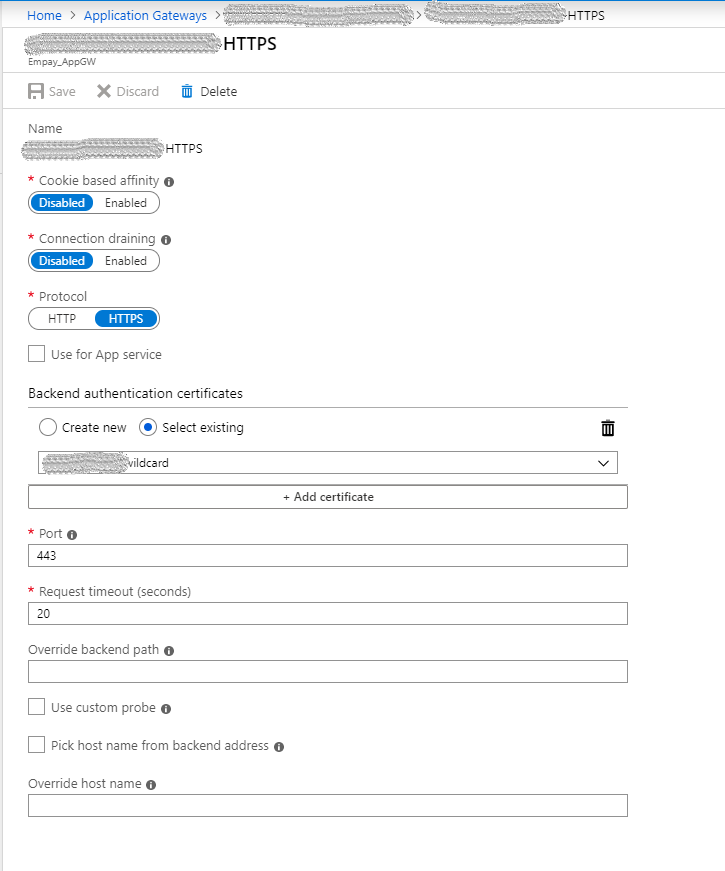

For most cases we do SSL offloading at the Application Gateway end. i.e, HTTPS traffic between public and application gateway, HTTP traffic between application gateway and websites hosted under it. But in some cases we need end to end SSL. In our case, it was for the Identity Server.

So lets start, We pointed the domain to the Application Gateway Public IP and We assume you purchased the SSL for your domain and we need the SSL certificate in two formats.

1. **PFX** format for application gateway HTTPS listener.
2. **CER** format for application gateway HTTP Settings.

Now we need to do the following,

1. Add an HTTPS listener for that domain with the Certificate.
2. Create a backend pool with the VM where we will publish the website in the IIS.
3. Add an HTTP Settings with the Certificate as shown in the picture.

4. Create a rule which connects the listener (1) and backend pool(2) via the newly created HTTP settings (3).

Once all this done, user will be able to hit Application Gateway with HTTPS and probably will see 404 since the VM not responding to the requests. So lets configure the VM to accept the traffic through 443 port. In the VM,

- Install the SSL certificate.
- Configure the HTTPS website in the IIS with that certificate and the hostname (domain).

After this done, check whether you are able to reach the website successfully. If you are getting any 502 errors, check the following

- In the Application Gateway, check the unhealthy backend pools.
- If our backend pool with the HTTPS HTTP settings name is in that unhealthy list, that indicates the VM in the backend pool not responding 200 back to the health probe check.
- By default health probe check for HTTPS will sent health check requests to the VM's IP on 443 port, and in the IIS, no website will be listening for 443 port (Without any hostname specified).
- To overcome, all we have to do is, on the default website (if there is no default site, add another binding to our site) as shown below,

Once this done, watch the unhealthy backend pools and you may notice that our backend pool is healthy now (It will take at least 30 seconds to update). Now application gateway will route traffic to our VM over HTTPS and the VM will serve the website and we are done.

### Additional Resources

- [Quickstart - Configure end-to-end SSL encryption with Azure Application Gateway - Azure portal | Microsoft Docs](https://docs.microsoft.com/en-us/azure/application-gateway/end-to-end-ssl-portal)
