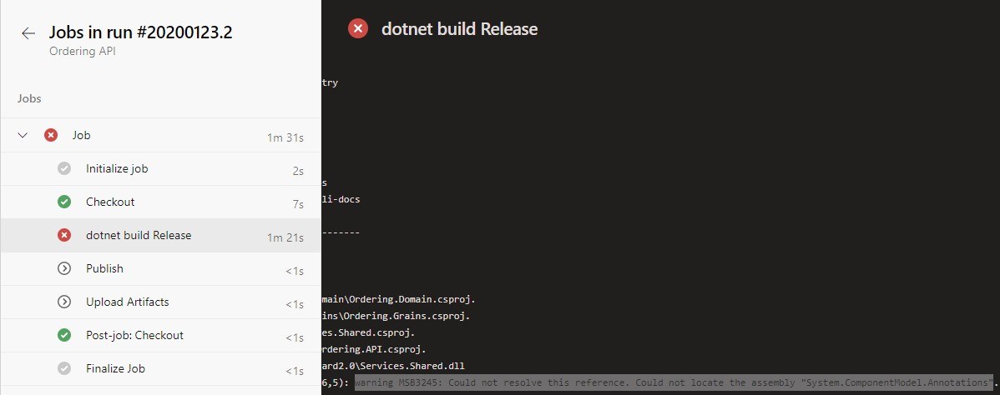
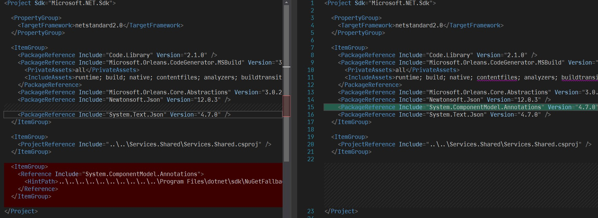

We were configuring CI/CD for one of our **.NET Core 3.1** API project in the Azure DevOps. When trying `dotnet build` from our local workstation, it was successfull but when CI triggered the build on the **Azure DevOps**, it was failing.

The Azure Pipeline yml looks like,

```yml
pool:
  vmImage: "windows-latest"

variables:
  buildConfiguration: "Release"

steps:
  - task: DotNetCoreCLI@2
    displayName: "dotnet build $(buildConfiguration)"
    inputs:
      command: "build"
      projects: |
        path/to/project/*.csproj
      arguments: "--configuration $(buildConfiguration)"
```

The build step successfully restored the NuGet packages which we can see in the logs,

```txt
Restore completed in 14.41 sec for d:\a\1\s\path\to\project\Project.Name.csproj.
```

But the step was failing with the following reference missing error.

> C:\Program Files\dotnet\sdk\3.1.100\Microsoft.Common.CurrentVersion.targets(2106,5): warning MSB3245: Could not resolve this reference. Could not locate the assembly "System.ComponentModel.Annotations". Check to make sure the assembly exists on disk. If this reference is required by your code, you may get compilation errors. [d:\a\1\s\path\to\project\Project.Name.csproj]



When checked the project reference, found out that the reference to `System.ComponentModel.Annotations` was added from **assembly** instead of Nuget. Fixed it by removing the assembly reference and adding the NuGet package of `System.ComponentModel.Annotations`.



Commited the changes and initiated a hotfix release. Tada, the build succeeded.
