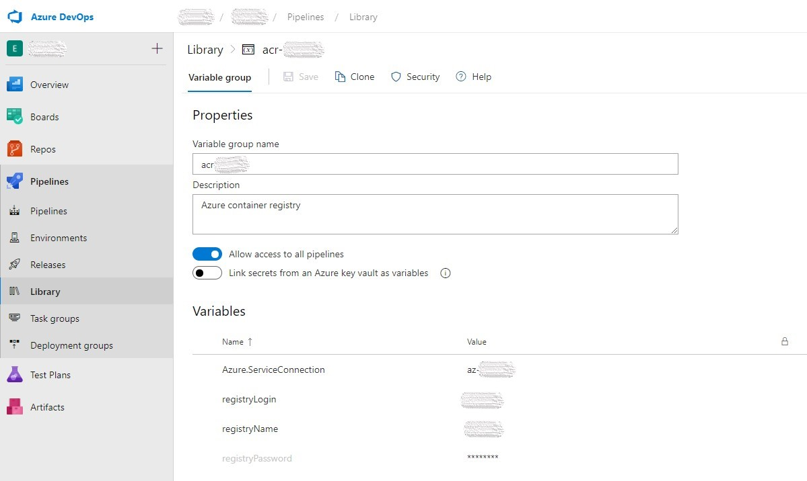

Azure is my favorite cloud provider. We use [Azure](/topics/azure/) for most of the infra & services.
Our code goes to [Azure DevOps](/topics/azure-devops/), we use **Azure Container Registry (ACR)** to host our docker container images and our [Kubernetes](/topics/kubernetes/) clusters running in [Azure Kubernetes Service (AKS)](/topics/aks/).

We configured the CI/CD pipelines in Azure DevOps.
In my case, we have a **monorepo** that contains several [ASP.NET Core](/topics/aspnet-core/) [microservices](/topics/microservices/) and the folder structure looks like below, which we inherited from [eShopOnContainers](https://github.com/dotnet-architecture/eShopOnContainers).

```
- build
  - azure-devops
    - common
      - ci-steps-template.yml
      - ci-vars-template.yml
    - project-one
      - ci-pipeline.yml
    - project-two
- deploy

  - azure-devops
    - common
      - cd-steps-template.yml
      - cd-steps-template-prod.yml
      - cd-vars-template.yml
    - project-one
      - cd-pipeline.yml
    - project-two
  - k8s
    - helm
      - project-one
      - project-two

- src
  - Services
    - Project-One
    - Project-Two
```

One of the great articles that helped me to initial setup the CI/CD is given below.
Its kind of outdated now since it is using `az acr helm` commands which were deprecated later.
But it is still worth reading. So definitely check it out.

:point_right: [Tutorial: Using Azure DevOps to setup a CI/CD pipeline and deploy to Kubernetes](https://cloudblogs.microsoft.com/opensource/2018/11/27/tutorial-azure-devops-setup-cicd-pipeline-kubernetes-docker-helm/)

## CI Pipeline

The CI pipeline does the following,

- Build a Docker image and push to ACR
- Build Helm chart and push to ACR

### Prerequisites

- [Helm](/topics/helm/) chart for your project. Here my chart directory is located at `deploy > k8s > helm`. To create a new chart for your project, refer [Helm Create](https://helm.sh/docs/helm/helm_create/).
- **acr-connection-name**: ACR service connection in Azure DevOps. You can add it under `Azure DevOps > Project > Project Settings > Service Connections`.

The ACR credentials I stored in the Azure DevOps **Variable Groups** (acr-variable-group).

| Name             | Value         |
| ---------------- | ------------- |
| registryName     | Your ACR name |
| registryLogin    | ACR login     |
| registryPassword | ACR password  |



### Common

#### ci-vars-template.yml

```yml
parameters:
  projectName: ""
  dockerRegistryServiceConnectionName: ""
  dockerfile: ""
  buildContext: ""

variables:
  helmVersion: 3.2.3
  HELM_EXPERIMENTAL_OCI: 1
  registryServerName: "$(registryName).azurecr.io"
  dockerRegistryServiceConnectionName: ${{ parameters.dockerRegistryServiceConnectionName }}
  dockerfile: ${{ parameters.dockerfile }}
  buildContext: ${{ parameters.buildContext }}
  projectName: ${{ parameters.projectName }}
  imageName: ${{ parameters.projectName }}
  imageTag: $(build.sourceBranchName)
  helmChartVersion: $(build.sourceBranchName)
  helmfrom: $(Build.SourcesDirectory)/deploy/k8s/helm
  helmto: $(Build.ArtifactStagingDirectory)/deploy/k8s/helm
```

Few things to note here,

- `HELM_EXPERIMENTAL_OCI` is to enable OCI support in the Helm 3 client. Currently, this support is experimental.
- `build.sourceBranchName` as the image tag and chart version is handy if you are following **Gitflow** (which we follow) or similar [git](/topics/git/) branching convention, so each release (eg, refs/tags/project-one/2.2.6) will generate [Docker](/topics/docker/) image and Helm chart with the same version.

#### ci-steps-template.yml

```yml
steps:
  - task: Docker@2
    displayName: Build and push an image to container registry
    inputs:
      command: buildAndPush
      repository: $(imageName)
      dockerfile: $(dockerfile)
      containerRegistry: $(dockerRegistryServiceConnectionName)
      buildContext: $(buildContext)
      tags: |
        $(imageTag)

  - task: HelmInstaller@1
    displayName: "install helm"
    inputs:
      helmVersionToInstall: $(helmVersion)
  - bash: |
      echo $(registryPassword) | helm registry login $(registryName).azurecr.io --username $(registryLogin) --password-stdin
      cd deploy/k8s/helm/
      helm chart save $(helm package --app-version $(imageTag) --version $(helmChartVersion) ./$(projectName) | grep -o '/.*.tgz') $(registryName).azurecr.io/charts/$(projectName):$(imageTag)
      helm chart push $(registryName).azurecr.io/charts/$(projectName):$(helmChartVersion)
      echo $(jq -n --arg version "$(helmChartVersion)" '{helmChartVersion: $version}') > $(build.artifactStagingDirectory)/variables.json
    failOnStderr: true
    displayName: "helm package"
  - task: CopyFiles@2
    inputs:
      sourceFolder: $(helmfrom)
      targetFolder: $(helmto)
  - publish: $(build.artifactStagingDirectory)
    artifact: build-artifact
```

The steps in the CI pipeline we moved to a common template file `ci-steps-template.yml` so that we can reuse it on other pipelines as well, and the steps include,

1. Build and push the docker image
2. Installs Helm client
3. A series of script which does

   - Authenticate to ACR
   - Creates and push Helm chart to ACR.
   - Creates `variables.json` which contain the newly created Helm chart version. Which we will use to fetch the right chart version during CD.

4. Copy some additional files to the artifact. Which we can use to override Helm chart values.

### ci-pipeline.yml

```yml
trigger:
  branches:
    include:
      - refs/tags/project-one/*
  paths:
    include:
      - src/Services/ProjectOne/*

pr: none

pool:
  vmImage: "ubuntu-latest"

variables:
  - group: acr-variable-group
  - template: ../common/ci-vars-template.yml
    parameters:
      projectName: "project-one"
      dockerRegistryServiceConnectionName: "acr-connection-name"
      dockerfile: "src/Services/Project-One/Dockerfile"
      buildContext: "$(System.DefaultWorkingDirectory)"

steps:
  - template: ../common/ci-steps-template.yml
```

If everything went well, you will have two repositories under your ACR.

- **project-one** which contains the Docker image
- **chart/project-one** for the Helm chart

---

## CD Pipeline

The CD pipeline will install the Helm chart on AKS.
The CD pipeline stage requires following details,

| Name          | Value                      |
| ------------- | -------------------------- |
| aks           | AKS name                   |
| rg            | AKS resource group         |
| aksSpTenantId | Subscription tenant id     |
| aksSpId       | Service principal Id       |
| aksSpSecret   | Service principal password |

These credentials I stored in another varible group named `aks-variable-group`.

### Helpful commands

#### Service principal credentials

Create new service principal `aks-name-deploy` by

```bash
az ad sp create-for-rbac -n aks-name-deploy --scopes aks-resource-id --role "Azure Kubernetes Service Cluster User Role" --query password -o tsv
```

Where `aks-resource-id` is,

```shell
az aks show -n $aks -g $rg --query id -o tsv
```

The above command will output service principal password `aksSpSecret`.

To get service principal id `aksSpId`,

```bash
az ad sp show --id http://aks-name-deploy --query appId -o tsv
```

Also we need to attach ACR with AKS so that AKS can pull our private docker images from our ACR.

#### Attach ACR with AKS

```bash
az aks update -g $rg -n $aks --attach-acr acr-resource-id
```

Where `acr-resource-id` is the output of,

```bash
az acr show -n $registryName -g acr-resource-group-name --query id -o tsv
```

#### Get Azure Tenant Id

To get tenantId `aksSpTenantId`,

```bash
az account show --query tenantId -o tsv
```

Now lets explore the pipeline YAML files.

### Common

#### cd-vars-template.yml

```yml
parameters:
  projectName: ""

variables:
  helmVersion: 3.2.3
  HELM_EXPERIMENTAL_OCI: 1
  registryServerName: "$(registryName).azurecr.io"
  projectName: ${{ parameters.projectName }}
```

#### cd-steps-template.yml

```yml
steps:
  - checkout: none
  - task: HelmInstaller@1
    displayName: "install helm"
    inputs:
      helmVersionToInstall: $(helmVersion)
  - download: ci-pipeline
    artifact: build-artifact
  - bash: |
      az login \
           --service-principal \
           -u $(aksSpId) \
           -p '$(aksSpSecret)' \
           --tenant $(aksSpTenantId)
       az aks get-credentials \
           -n $(aks) \
           -g $(rg)
       echo $(registryPassword) | helm registry login $(registryServerName) --username $(registryLogin) --password-stdin
       helmChartVersion=$(jq .helmChartVersion $(pipeline.workspace)/ci-pipeline/build-artifact/variables.json -r)
       helm chart pull $(registryServerName)/charts/$(projectName):$helmChartVersion
       helm chart export $(registryServerName)/charts/$(projectName):$helmChartVersion --destination $(pipeline.workspace)/install
       helm upgrade \
           --namespace $(k8sNamespace) \
           --create-namespace \
           --install \
           --wait \
           --version $helmChartVersion \
           --set image.repository=$(registryServerName)/$(projectName) \
           -f $(pipeline.workspace)/ci-pipeline/build-artifact/deploy/k8s/helm/app.yaml \
           -f $(pipeline.workspace)/ci-pipeline/build-artifact/deploy/k8s/helm/inf.yaml \
           $(projectName) \
           $(pipeline.workspace)/install/$(projectName)
    failOnStderr: true
    displayName: "deploy helm chart"
```

The common CD steps include a series of script which does,

- Authenticate to Azure using the service principal credentials
- Set the specified AKS cluster as the context.
- Authenticate ACR with the ACR credentials (The same credentials we used in CI pipeline defined in the `acr-variable-group`)
- Extract the Helm chart version that need to install
- Pulls the Helm chart and installs (or upgrade) it. Here we are overriding the chart image repository to our ACR repository and some additional common values (app.yaml & inf.yaml).

### cd-pipeline.yml

```yml
trigger: none
pr: none

# define variables: registryName, registryLogin and registryPassword in the Azure pipeline UI definition
variables:
  - group: acr-variable-group
  - template: ../common/cd-vars-template.yml
    parameters:
      projectName: "project-one"
  - name: k8sNamespace
    value: myteam

resources:
  pipelines:
    - pipeline: ci-pipeline
      source: "project-one-ci"
      trigger:
        enabled: true
        branches:
          include:
            - refs/tags/project-one/*

# define 5 variables: aks, rg, aksSpId, aksSpSecret and aksSpTenantId in the Azure pipeline UI definition
stages:
  - stage: test
    displayName: test
    jobs:
      - deployment: test
        variables:
          - group: aks-variable-group
        displayName: deploy helm chart into AKS
        pool:
          vmImage: ubuntu-latest
        environment: test-$(projectName)
        strategy:
          runOnce:
            deploy:
              steps:
                - template: ../common/cd-steps-template.yml
  - stage: production
    displayName: production
    jobs:
      - deployment: production
        variables:
          - group: aks-prod-variable-group
        displayName: deploy helm chart into AKS
        pool:
          vmImage: ubuntu-latest
        environment: production-$(projectName)
        strategy:
          runOnce:
            deploy:
              steps:
                - template: ../common/cd-steps-template-prod.yml
```

In the CD pipeline above, I have defined two stages, one for TEST and one for PROD.
The main difference between them is in the variable group used.
`aks-variable-group` has the TEST cluster values and you guessed right, `aks-prod-variable-group` has the PROD cluster values.
And the difference between `cd-steps-template.yml` and `cd-steps-template-prod.yml` is that prod file has some additional chart value overrides with respect to our PRODUCTION environment.

### cd-steps-template-prod.yml

```yml
steps:
  - checkout: none
  - task: HelmInstaller@1
    displayName: "install helm"
    inputs:
      helmVersionToInstall: $(helmVersion)
  - download: ci-pipeline
    artifact: build-artifact
  - bash: |
      az login \
           --service-principal \
           -u $(aksSpId) \
           -p '$(aksSpSecret)' \
           --tenant $(aksSpTenantId)
       az aks get-credentials \
           -n $(aks) \
           -g $(rg)
       echo $(registryPassword) | helm registry login $(registryServerName) --username $(registryLogin) --password-stdin
       helmChartVersion=$(jq .helmChartVersion $(pipeline.workspace)/ci-pipeline/build-artifact/variables.json -r)
       helm chart pull $(registryServerName)/charts/$(projectName):$helmChartVersion
       helm chart export $(registryServerName)/charts/$(projectName):$helmChartVersion --destination $(pipeline.workspace)/install
       helm upgrade \
           --namespace $(k8sNamespace) \
           --create-namespace \
           --install \
           --wait \
           --version $helmChartVersion \
           --set image.repository=$(registryServerName)/$(projectName) \
           -f $(pipeline.workspace)/ci-pipeline/build-artifact/deploy/k8s/helm/app.yaml \
           -f $(pipeline.workspace)/ci-pipeline/build-artifact/deploy/k8s/helm/inf.yaml \
           -f $(pipeline.workspace)/ci-pipeline/build-artifact/deploy/k8s/helm/inf-prod.yaml \
           -f $(pipeline.workspace)/ci-pipeline/build-artifact/deploy/k8s/helm/$(projectName)/values-prod.yaml \
           $(projectName) \
           $(pipeline.workspace)/install/$(projectName)
    failOnStderr: true
    displayName: "deploy helm chart"
```

Few more Notes

- CD pipeline is also **YAML** based (You gonna like it), hence create it like a regular pipeline (Not as RELEASE) in the Azure DevOps, and choose the `cd-pipeline.yml` after choosing to create pipeline based on **Existing Azure Pipelines YAML file**.
- Once you create the CD pipeline, check the **Environments** under Azure DevOps Pipelines. There will be two environments as per the above example, test-project-one and production-project-one. Inside each, you can configure the approvals and more for the respective CD stages.

A sample reference source code is also pushed to [here](https://github.com/abhith/abhith.net/tree/master/samples/azure-devops-ci-cd-pipeline-involving-helm-3-acr-aks).

If you have any grey area in this article, feel free to shoot it in the comments below :point_down:, I will try to shed some light on that part.

---

https://twitter.com/AbhithRajan/status/1296763029850333184
