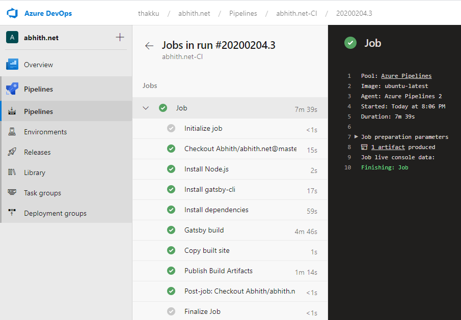
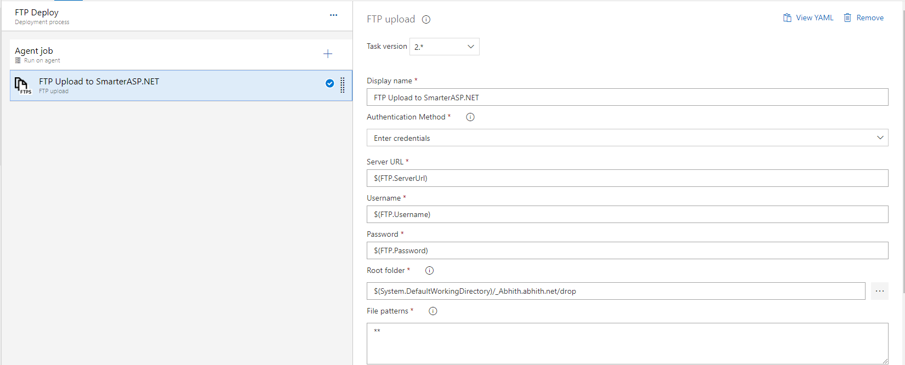

For long I was using **Netlify** to do **CI/CD** for `this` website and was using their free plan. But when they introduced the build minutes limit, I had to switch to another option.

https://twitter.com/AbhithRajan/status/1206789696950611969

I already have a paid account with [SmarterASP.NET][1] where I host [Piggy][2] and is very much suitable for personal side projects since it is very cheap. So I thought of moving back to [SmarterASP.NET][1] and for CI/CD **Azure DevOps Build & Release Pipelines** since am using the same at work.

## Build Pipeline

We used the YAML based pipeline and steps are self-explanatory.

```yml
trigger:
  - master

pool:
  vmImage: "ubuntu-latest"

steps:
  - task: NodeTool@0
    inputs:
      versionSpec: "10.x"
    displayName: "Install Node.js"

  - script: |
      npm install -g gatsby-cli
    displayName: "Install gatsby-cli"

  - script: |
      yarn install
    displayName: "Install dependencies"

  - script: |
      yarn build
    displayName: "Gatsby build"

  - task: CopyFiles@2
    inputs:
      sourceFolder: "public"
      contents: "**"
      targetFolder: "$(Build.ArtifactStagingDirectory)"
      cleanTargetFolder: true
    displayName: "Copy built site"
    condition: and(succeeded(), ne(variables['Build.Reason'], 'PullRequest'))

  - task: PublishBuildArtifacts@1
    inputs:
      PathtoPublish: "$(Build.ArtifactStagingDirectory)"
      ArtifactName: "drop"
      publishLocation: "Container"
    condition: and(succeeded(), ne(variables['Build.Reason'], 'PullRequest'))
    displayName: "Publish Build Artifacts"
```

This pipeline will run for pull request as well. In those cases we don't need to build the artifacts. That's why we put the below condition for **CopyFiles@2** and **PublishBuildArtifacts@1** tasks.

```yml
condition: and(succeeded(), ne(variables['Build.Reason'], 'PullRequest'))
```

And a successfull build looks like,



## Release Pipeline

Once we configured our build pipeline, created a release pipeline.

### Build pipeline vs Release pipeline

> A build is a pipeline that has no side-effects, it only takes in code and puts out compiled "artifacts". A release is a pipeline that has side-effects, it takes in artifacts and publishes or deploys them to environments.

For the release pipeline, in case of [SmarterASP.NET][1], the stage contain one job and it has only one task, the **FTP Upload**.



And the yml for the same look like below,

```yml
steps:
- task: FtpUpload@2
  displayName: 'FTP Upload to SmarterASP.NET'
  inputs:
    credentialsOption: inputs
    serverUrl: '$(FTP.ServerUrl)'
    username: '$(FTP.Username)'
    password: '$(FTP.Password)'
    rootDirectory: '$(System.DefaultWorkingDirectory)/_Abhith.abhith.net/drop'
    remoteDirectory: /sitefolder/
    preservePaths: true
    trustSSL: true
  condition: and(succeeded(), ne(variables['Build.Reason'], 'PullRequest'))
``
```

### Notes

- All the **\$(---)** are pipeline variables
- **rootDirectory** can be browsed through the **...** button near to the **Root folder** text input (check the comments below)

Even though I have successfully configured the CI/CD. But the time it took to complete the deployment was too long since the artifact size was high. The **gatsby-images** generate so many versions of the image files resulting increase in the artifact size. So the FTP upload takes so much time to finish.

https://twitter.com/AbhithRajan/status/1210656334338764802

Because of this, I searched for another hosting provider and found out [Render][3]. They have a free plan for static sites and offers almost similar experience when comparing to Netlify.

If you know any better hosting solution for GatsbyJs website, let me know in the comments. :point_down:

[1]: https://www.SmarterASP.NET/index?r=100571651
[2]: https://github.com/piggyvault/piggyvault
[3]: https://render.com
