import Alert from "../../src/components/alert";

I love to monitor things. **Application Insights** is one of my favorite tools in this category.
Checking **Failures** and **Performance** sections on the Application Insights were my first thing in the morning for some time in the past.
Since some apps especially built by third parties lack Application Insights integration, we check **Application Gateway** access logs too.

Instead of manually checking every day, to ease the process what I did is configured a couple of logic apps to send a message on the **Teams** channel with a list of results from **Application Insights** and **Azure Monitor** Logs.

The configured daily reports include,

- Application Insights - Performance
- Application Gateway - Failures

The steps involved in configuring these are almost similar.

First, you need to define the query, in the logs section of each service try out your query and see if the expected results coming.
Then we need to design an **Adaptive card** for teams. This can be easily done on [adaptivecards.io](https://adaptivecards.io/).

## Adaptive Cards

> Adaptive Cards are platform-agnostic snippets of UI, authored in JSON, that apps and services can openly exchange. When delivered to a specific app, the JSON is transformed into native UI that automatically adapts to its surroundings. It helps design and integrate light-weight UI for all major platforms and frameworks.

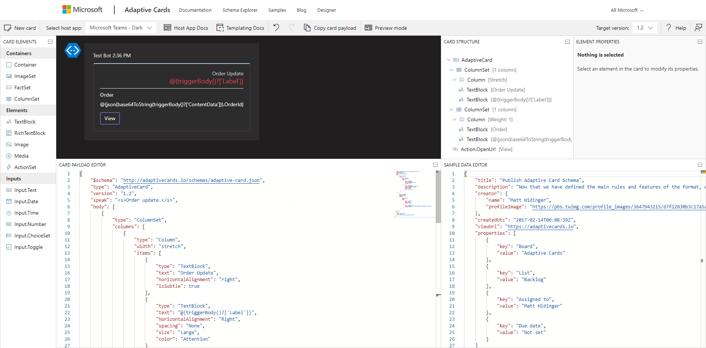

The easiest way to design the adaptive card is to pick the matching sample from the [adaptivecards.io website](https://adaptivecards.io/samples/) and edit it in the live designer there itself to adjust it to your needs.

Couple of cards which I designed that suited my needs shared below,

### Simple card

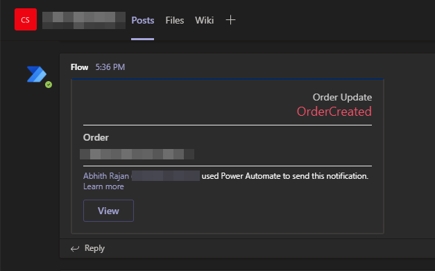

The `schema` of the same given below,

```json
{
  "$schema": "http://adaptivecards.io/schemas/adaptive-card.json",
  "type": "AdaptiveCard",
  "version": "1.2",
  "speak": "<s>Order update.</s>",
  "body": [
    {
      "type": "ColumnSet",
      "columns": [
        {
          "type": "Column",
          "width": "stretch",
          "items": [
            {
              "type": "TextBlock",
              "text": "Order Update",
              "horizontalAlignment": "right",
              "isSubtle": true
            },
            {
              "type": "TextBlock",
              "text": "@{triggerBody()?['Label']}",
              "horizontalAlignment": "Right",
              "spacing": "None",
              "size": "Large",
              "color": "Attention"
            }
          ]
        }
      ]
    },
    {
      "type": "ColumnSet",
      "spacing": "Medium",
      "separator": true,
      "columns": [
        {
          "type": "Column",
          "width": 1,
          "items": [
            {
              "type": "TextBlock",
              "text": "Order",
              "isSubtle": true,
              "weight": "Bolder"
            },
            {
              "type": "TextBlock",
              "text": "@{json(base64ToString(triggerBody()?['ContentData'])).OrderId}",
              "spacing": "Small"
            }
          ]
        }
      ]
    }
  ],
  "actions": [
    {
      "type": "Action.OpenUrl",
      "title": "View",
      "url": "https://my-website.com/path/to/resource"
    }
  ]
}
```

The above card is used to notify when there is a new message in an **Azure Service Bus Topic** and the `@{triggerBody()?['Label']}` is used to get the **Message Label**.

Similarly, `@{json(base64ToString(triggerBody()?['ContentData'])).OrderId}` is used to get the `OrderId` from the message body.

> Our focus in this article is on a card with a list of items.

### Card with a list of items

Initial design with a single row of information will look like,

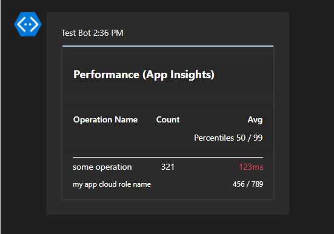

And it's `schema`,

```json
{
  "type": "AdaptiveCard",
  "body": [
    {
      "type": "Container",
      "style": "emphasis",
      "items": [
        {
          "type": "ColumnSet",
          "columns": [
            {
              "type": "Column",
              "items": [
                {
                  "type": "TextBlock",
                  "size": "Large",
                  "weight": "Bolder",
                  "text": "**Performance (App Insights)**"
                }
              ],
              "width": "stretch"
            }
          ]
        }
      ],
      "bleed": true
    },
    {
      "type": "Container",
      "spacing": "Large",
      "style": "emphasis",
      "items": [
        {
          "type": "ColumnSet",
          "columns": [
            {
              "type": "Column",
              "spacing": "Large",
              "items": [
                {
                  "type": "TextBlock",
                  "weight": "Bolder",
                  "text": "Operation Name"
                }
              ],
              "width": "stretch"
            },
            {
              "type": "Column",
              "items": [
                {
                  "type": "TextBlock",
                  "weight": "Bolder",
                  "text": "Count"
                }
              ],
              "width": "auto"
            },
            {
              "type": "Column",
              "items": [
                {
                  "type": "TextBlock",
                  "weight": "Bolder",
                  "text": "Avg",
                  "horizontalAlignment": "Right"
                },
                {
                  "type": "TextBlock",
                  "text": "Percentiles 50 / 99",
                  "horizontalAlignment": "Right"
                }
              ],
              "width": "stretch",
              "horizontalAlignment": "Right"
            }
          ]
        }
      ],
      "bleed": true
    },
    {
      "type": "Container",
      "items": [
        {
          "columns": [
            {
              "items": [
                {
                  "text": "some operation",
                  "type": "TextBlock",
                  "wrap": true
                },
                {
                  "size": "Small",
                  "text": "my app cloud role name",
                  "type": "TextBlock",
                  "wrap": true
                }
              ],
              "spacing": "Large",
              "type": "Column",
              "width": "stretch"
            },
            {
              "items": [
                {
                  "horizontalAlignment": "Right",
                  "separator": true,
                  "text": "321 ",
                  "type": "TextBlock"
                }
              ],
              "type": "Column",
              "width": "auto"
            },
            {
              "items": [
                {
                  "color": "Attention",
                  "horizontalAlignment": "Right",
                  "text": "123ms",
                  "type": "TextBlock"
                },
                {
                  "horizontalAlignment": "Right",
                  "size": "Small",
                  "text": "456 / 789",
                  "type": "TextBlock"
                }
              ],
              "type": "Column",
              "width": "stretch"
            }
          ],
          "type": "ColumnSet"
        }
      ],
      "separator": true
    }
  ],
  "$schema": "http://adaptivecards.io/schemas/adaptive-card.json",
  "version": "1.2",
  "fallbackText": "This card requires Adaptive Cards v1.2 support to be rendered properly."
}
```

In the schema, there are three **Container**,

- First one contains the main heading
- Second column headings
- The last one with the data.

We will be dynamically populating the third container items. And the result looks like,

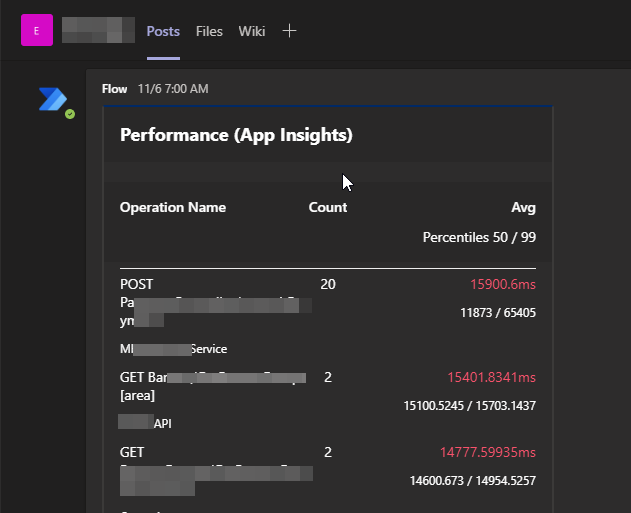

And for a reference, A slightly altered design also given below,

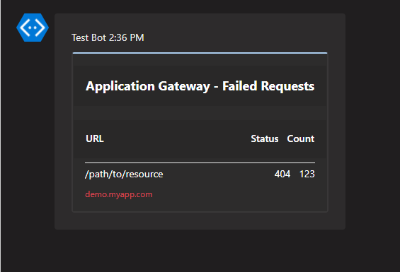

And the `schema` for this one is,

```json
{
  "type": "AdaptiveCard",
  "body": [
    {
      "type": "Container",
      "style": "emphasis",
      "items": [
        {
          "type": "ColumnSet",
          "columns": [
            {
              "type": "Column",
              "items": [
                {
                  "type": "TextBlock",
                  "size": "large",
                  "weight": "bolder",
                  "text": "**Application Gateway - Failed Requests**"
                }
              ],
              "width": "stretch"
            }
          ]
        }
      ],
      "bleed": true
    },
    {
      "type": "Container",
      "spacing": "Large",
      "style": "emphasis",
      "items": [
        {
          "type": "ColumnSet",
          "columns": [
            {
              "type": "Column",
              "spacing": "Large",
              "items": [
                {
                  "type": "TextBlock",
                  "weight": "Bolder",
                  "text": "URL"
                }
              ],
              "width": "stretch"
            },
            {
              "type": "Column",
              "items": [
                {
                  "type": "TextBlock",
                  "weight": "Bolder",
                  "text": "Status",
                  "horizontalAlignment": "Right"
                }
              ],
              "width": "auto"
            },
            {
              "type": "Column",
              "items": [
                {
                  "type": "TextBlock",
                  "weight": "Bolder",
                  "text": "Count",
                  "horizontalAlignment": "Right"
                }
              ],
              "width": "auto"
            }
          ]
        }
      ],
      "bleed": true
    },
    {
      "type": "Container",
      "items": [
        {
          "columns": [
            {
              "items": [
                {
                  "text": "/path/to/resource",
                  "type": "TextBlock",
                  "wrap": true
                },
                {
                  "color": "Attention",
                  "size": "Small",
                  "text": "demo.myapp.com",
                  "type": "TextBlock",
                  "wrap": true
                }
              ],
              "spacing": "Large",
              "type": "Column",
              "width": "stretch"
            },
            {
              "items": [
                {
                  "horizontalAlignment": "Right",
                  "separator": true,
                  "text": "404 ",
                  "type": "TextBlock"
                }
              ],
              "type": "Column",
              "width": "auto"
            },
            {
              "items": [
                {
                  "horizontalAlignment": "Right",
                  "separator": true,
                  "text": "123 ",
                  "type": "TextBlock"
                }
              ],
              "type": "Column",
              "width": "auto"
            }
          ],
          "type": "ColumnSet"
        }
      ],
      "separator": true
    }
  ],
  "$schema": "http://adaptivecards.io/schemas/adaptive-card.json",
  "version": "1.2",
  "fallbackText": "This card requires Adaptive Cards v1.2 support to be rendered properly."
}
```

When fed with data, the result is,

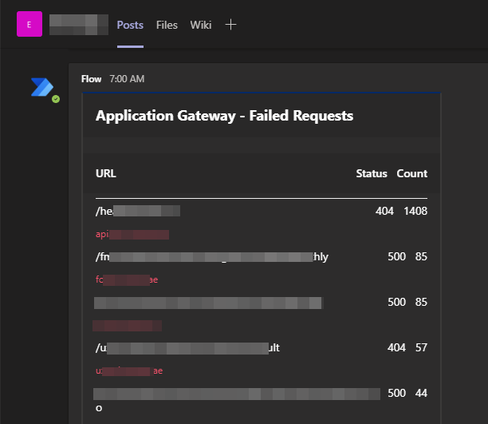

Once we are done with adaptive card design, it's time to move on to Logic App designer.

## Logic App

The only tricky part of the Logic app was to generate the rows of items. The other steps are pretty much straight forward. And the overall steps are,

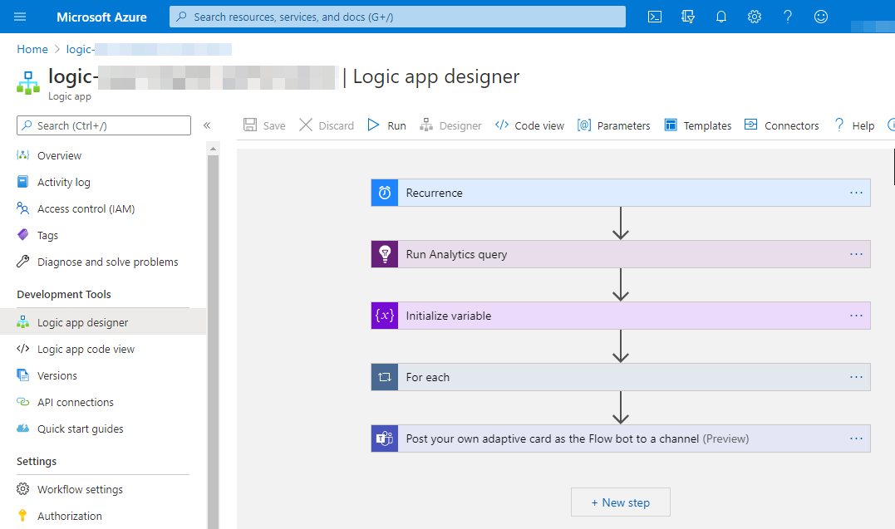

Let's go through each step.

### 1. Recurrence trigger

Configured it to trigger daily.

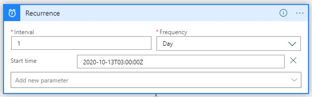

### 2. Getting a query result

For Application Insights query results, use the **Application Insights** connector and action **Run Analytics Query**

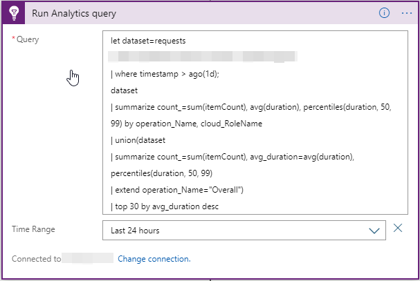

#### Query to get performance metrics from Application insights

```
let dataset=requests
| where timestamp > ago(1d);
dataset
| summarize count_=sum(itemCount), avg(duration), percentiles(duration, 50, 99) by operation_Name, cloud_RoleName
| union(dataset
| summarize count_=sum(itemCount), avg_duration=avg(duration), percentiles(duration, 50, 99)
| extend operation_Name="Overall")
| top 30 by avg_duration desc
```

And in case of **Application Gateway** access logs, we need to use the **Azure Monitor Logs** connector and it's **Run query and list results** action, details [here](https://docs.microsoft.com/en-us/connectors/azuremonitorlogs/#run-query-and-list-results).

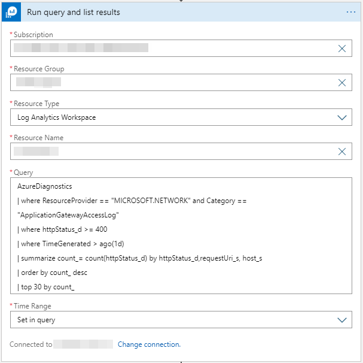

_Note: **Diagnostic setting** for **Application Gateway** should be configured to feed access log data to the log analytics workspace before._

#### Query to get failed requests summary from Application Gateway

```
AzureDiagnostics
| where ResourceProvider == "MICROSOFT.NETWORK" and Category == "ApplicationGatewayAccessLog"
| where httpStatus_d >= 400
| where TimeGenerated > ago(1d)
| summarize count_= count(httpStatus_d) by httpStatus_d,requestUri_s, host_s
| order by count_ desc
| top 30 by count_
```

<Alert kind="info">
  In both queries, I am limiting the number of results since the Teams post
  message action has a message size limit.
</Alert>

### 3. Initialize an array variable

Since we are expecting a list of rows from the above query, to map it to rows in the Teams card message, we use this.

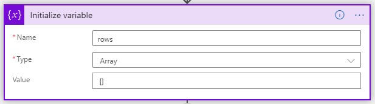

### 4. For each row in the query result, we map the result item to an Adaptive card row.

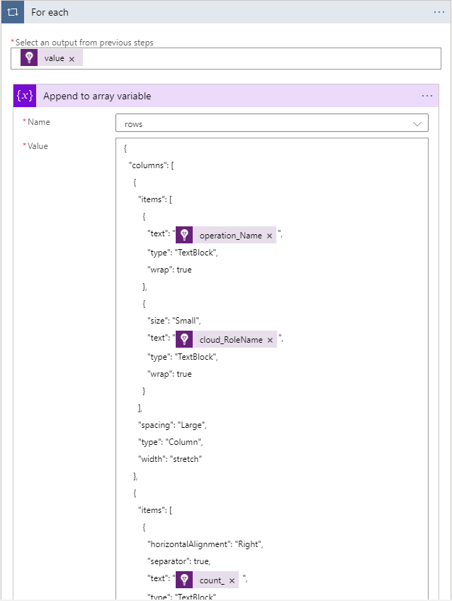

Here the `value` is an array of query results from step 2.
And for each item in the array, we are appending the **JSON object that represents the row of data in the adaptive card** (under the third **Container** items).

### 5. Append the rows to the rest of the Adaptive card schema in the Teams connector channel.

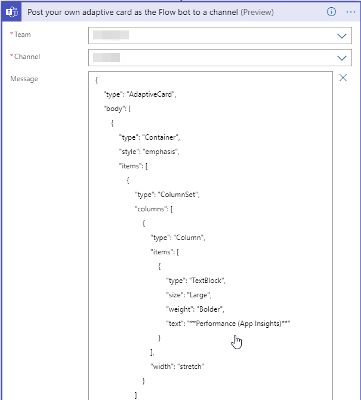

The full `Message` is,

```json
{
    "type": "AdaptiveCard",
    "body": [
        {
            "type": "Container",
            "style": "emphasis",
            "items": [
                {
                    "type": "ColumnSet",
                    "columns": [
                        {
                            "type": "Column",
                            "items": [
                                {
                                    "type": "TextBlock",
                                    "size": "Large",
                                    "weight": "Bolder",
                                    "text": "**Performance (App Insights)**"
                                }
                            ],
                            "width": "stretch"
                        }
                    ]
                }
            ],
            "bleed": true
        },
        {
            "type": "Container",
            "spacing": "Large",
            "style": "emphasis",
            "items": [
                {
                    "type": "ColumnSet",
                    "columns": [
                        {
                            "type": "Column",
                            "spacing": "Large",
                            "items": [
                                {
                                    "type": "TextBlock",
                                    "weight": "Bolder",
                                    "text": "Operation Name"
                                }
                            ],
                            "width": "stretch"
                        },
                        {
                            "type": "Column",
                            "items": [
                                {
                                    "type": "TextBlock",
                                    "weight": "Bolder",
                                    "text": "Count"
                                }
                            ],
                            "width": "auto"
                        },
                        {
                            "type": "Column",
                            "items": [
                                {
                                    "type": "TextBlock",
                                    "weight": "Bolder",
                                    "text": "Avg",
                                    "horizontalAlignment": "Right"
                                },
                                {
                                    "type": "TextBlock",
                                    "text": "Percentiles 50 / 99",
                                    "horizontalAlignment": "Right"
                                }
                            ],
                            "width": "stretch",
                            "horizontalAlignment": "Right"
                        }
                    ]
                }
            ],
            "bleed": true
        },
        {
            "type": "Container",
            "items": @{variables('rows')},
            "separator": true
        }
    ],
    "$schema": "http://adaptivecards.io/schemas/adaptive-card.json",
    "version": "1.2",
    "fallbackText": "This card requires Adaptive Cards v1.2 support to be rendered properly."
}
```

Notice the `@{variables('rows')}`, that's where the magic happens. So the array we prepared in the previous step gets appended here, and hence we get to see the multiple rows in the adaptive card. To understand better, cross-check the above one with the original `schema` mentioned in the very beginning [here](#card-with-a-list-of-items).

<Alert kind="info">
  The adaptive card schema version kept to 1.2 even though the latest version is
  1.3 since Microsoft Teams currently does not support 1.3. That may change in
  the future.
</Alert>

That's all. Run the logic app and see a message popping up on Teams.

---

https://twitter.com/AbhithRajan/status/1330952694161432581
