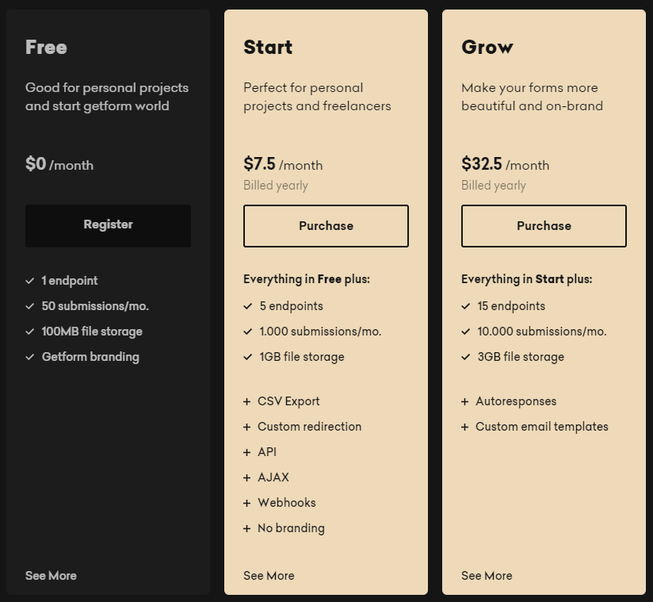
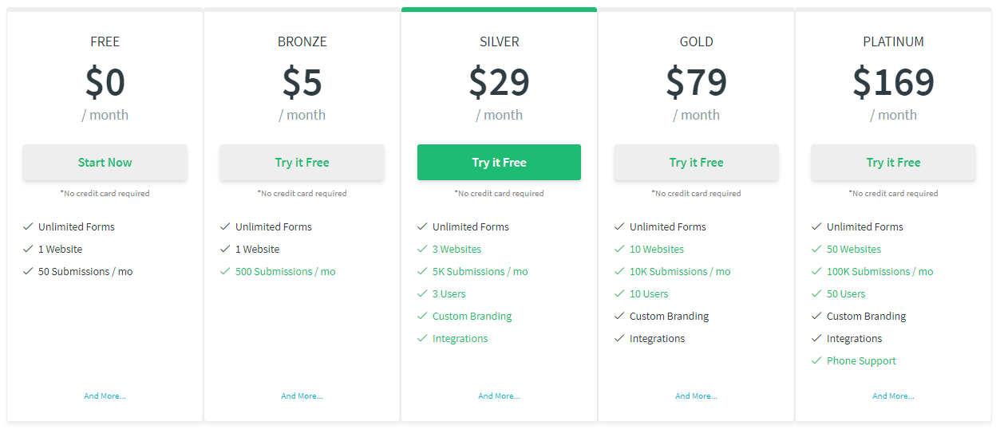
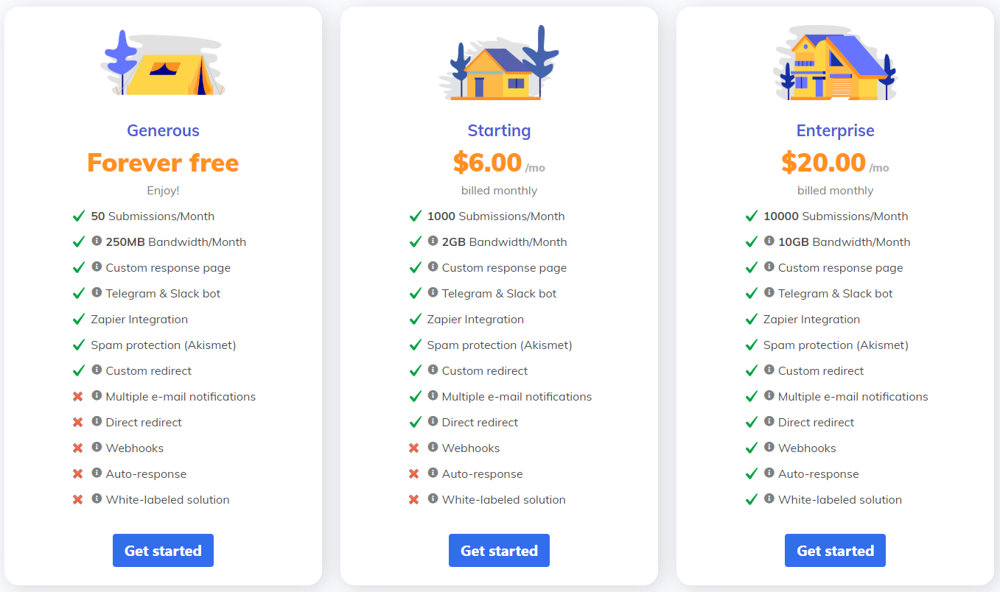
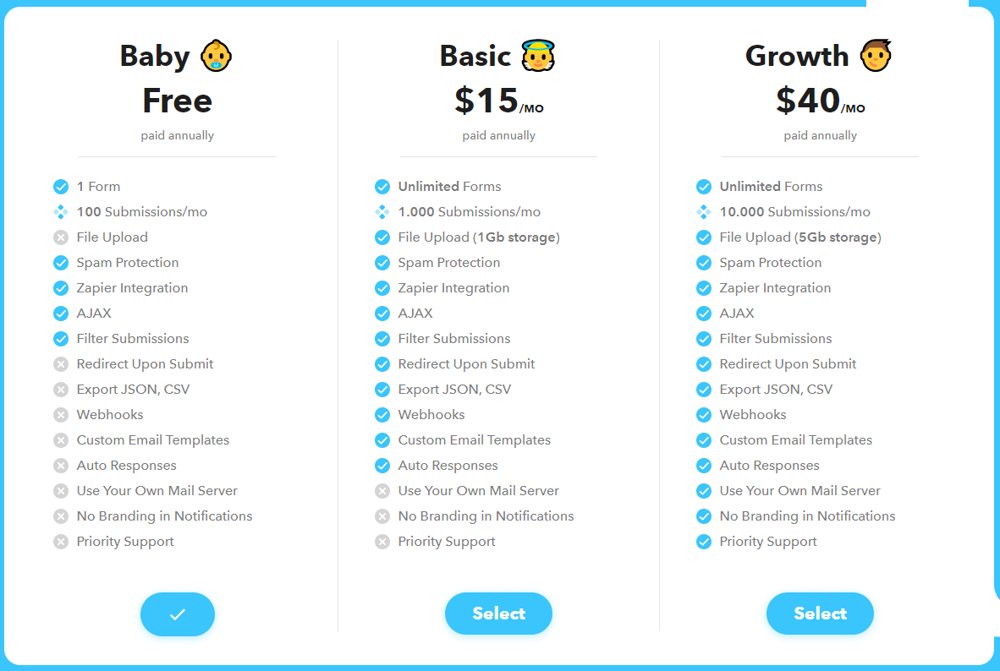

import Alert from "../../src/components/alert";

If you have a static website like a portfolio without a contact form then you are missing so many opportunities.
I realized it after adding a contact form on my website here.

Now you might be thinking about how difficult it is to add a form to your website, and I can tell you that it is easier than you think. Without any backend codes, we can consume some of the awesome **FORM BACKEND as a Service** providers. Some of them I explored yet are listed here.

## Services

<Alert kind="important">
  The plan details attached in this article are likely to get outdated soon
  since the service providers are likely to change their plans frequently.
</Alert>

### Getform

> Form backend platform for designers
> and developers

My current [contact form](/contact/) is powered by [Getform][1]. Their free plan details given below,

It indicates 100 Submissions in the FREE plan which I thought renews every month but the FAQ says it's not.
That triggered me to search for another provider who offers a better FREE plan.

If you want to check how I created the contact form in this Gatsby website using **[Getform][1]**, check my commit [here](https://github.com/Abhith/abhith.net/commit/ad46ca37cfd5bc76593aff0ca11a75156d1b77fb)

:point_right: [Getform.io | Easy form endpoints for your forms][1]

### Kwes forms

It looks like [Kwes][2] offers more features and a generous 50 submissions per month for FREE.

:point_right: [Kwes forms | Form Endpoint Service][2]

### SmartForms

[SmartForms][5] also offers 50 submissions per month for free.

:point_right: [SmartForms - Powerful and easy to setup form backend that alerts you on E-email, Slack and Telegram!][5]

### formcarry.

If you want more submissions per month for FREE, look for [formcarry][2]. It offers 100 submissions per month for FREE.

:point_right: [Formcarry. | Hassle-Free Form Backend][3]

### formsubmit

If you want unlimited submissions for FREE, **[Formsubmit][4]** is the one.

> Formsubmit sends all your form submissions to your email without having a need for any coding or a backbend. SignUp (optional) to get additional advantages.

And they don't even have a pricing page to show 💙

:point_right: [Formsubmit][4]

## Conclusion

I didn't switch from **[Getform][1]** yet and am still reviewing other services. I will update this article whenever I find better solutions.
If you know any good services in this category, let me know in the comments :point_down:

## Additional Resources

- [A Comparison of Static Form Providers | CSS-Tricks](https://css-tricks.com/a-comparison-of-static-form-providers/)
- [Services | Forms - The Power of Serverless for Front-End Developers](https://serverless.css-tricks.com/services/forms/)
- [Building a Contact Form | GatsbyJS](https://www.gatsbyjs.org/docs/building-a-contact-form/)

[1]: https://getform.io/
[2]: https://kwes.io/
[3]: https://formcarry.com/
[4]: https://formsubmit.io/
[5]: https://smartforms.dev/
