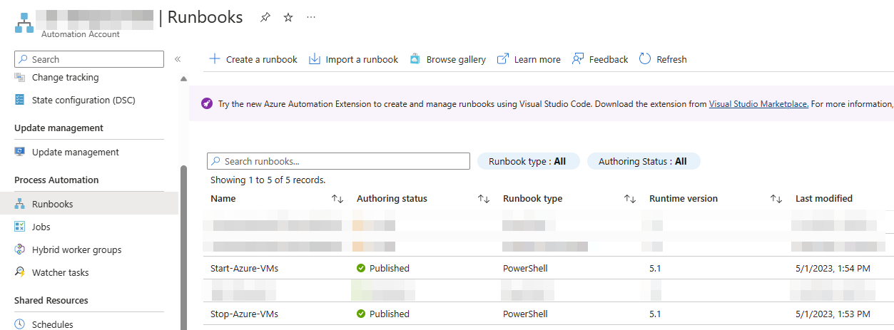
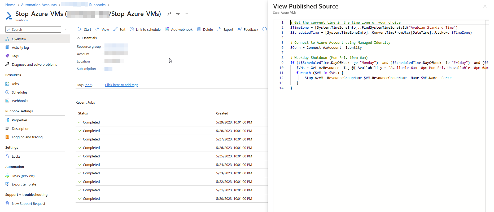
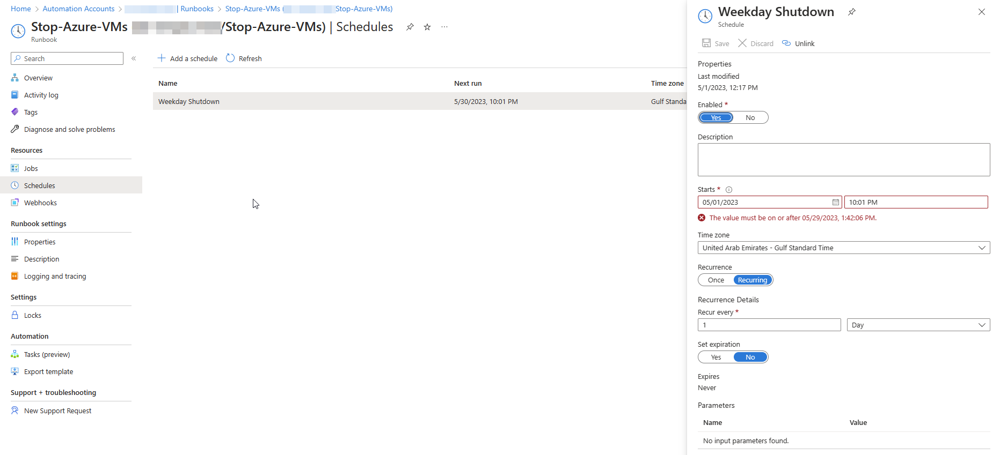
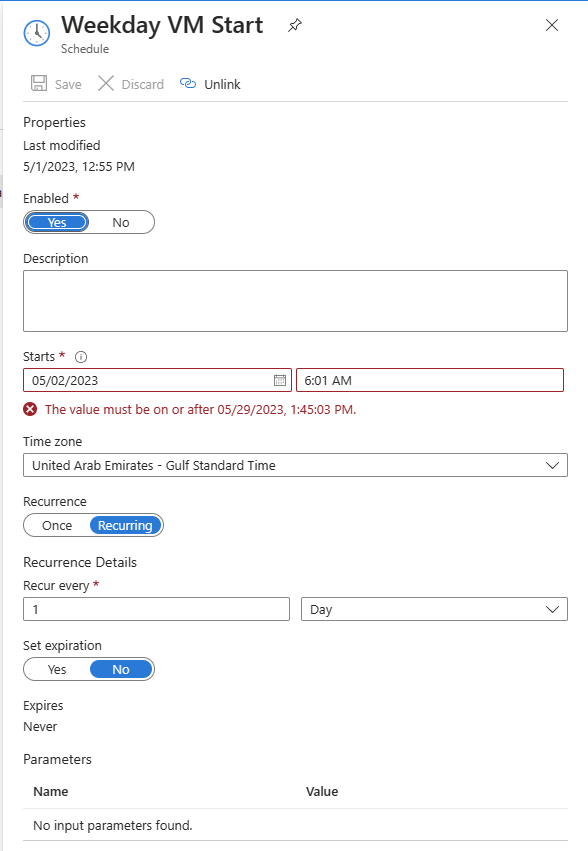
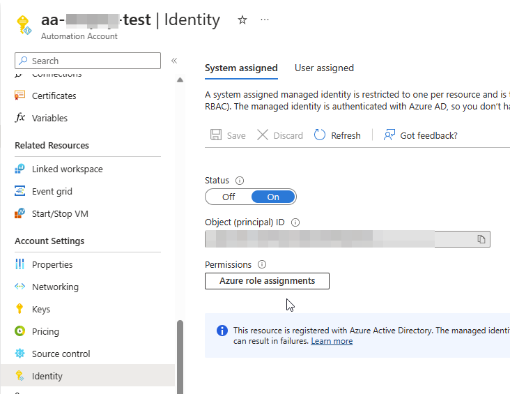
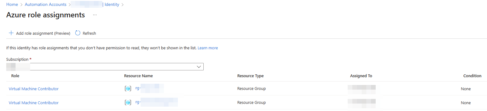
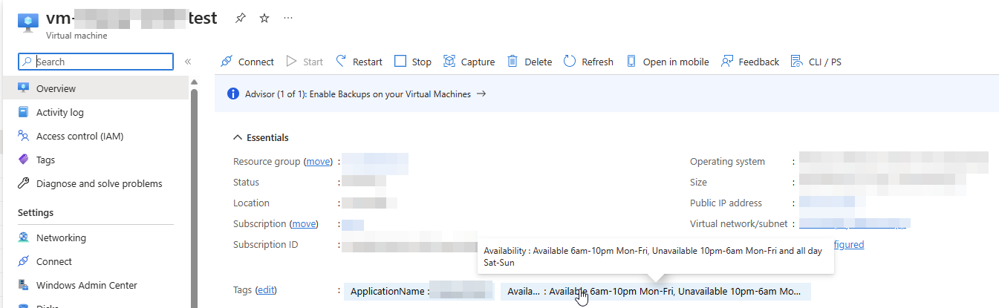

In today's cloud computing era, optimizing costs has become crucial for effective resource management. One area where organizations can achieve significant cost savings is by automating the shutdown and startup processes of virtual machines (VMs) in their test environments. Microsoft Azure offers various solutions to help accomplish this goal, and one powerful approach is through Azure Automation.

## The Significance of Cost Optimization

Test environments play a vital role in software development and testing processes. However, these environments often remain idle during non-working hours, such as nights and weekends. Continuously running VMs during these periods can lead to unnecessary expenses. By implementing an automated solution that shuts down and starts up VMs based on predefined schedules, organizations can save a substantial amount of money.

## Azure Automation: Streamlining Cost Optimization

Azure Automation is a cloud-based service that enables you to automate the management of your Azure resources. It offers a wide range of capabilities for process automation, configuration management, and update management. Through the use of **Runbooks**, you can schedule the shutdown and startup of VMs based on specific criteria, optimizing costs in test environments.



## Implementing VM Shutdown with Azure Automation



To implement the VM shutdown process, you can utilize PowerShell scripts within an Azure Automation runbook. The following code snippet illustrates how to shut down VMs during weekdays (Monday to Friday) from 10 PM to 6 AM:

```powershell
# Get the current time in the time zone of your choice
$TimeZone = [System.TimeZoneInfo]::FindSystemTimeZoneById("Arabian Standard Time")
$ScheduledTime = [System.TimeZoneInfo]::ConvertTimeFromUtc([DateTime]::UtcNow, $TimeZone)

# Connect to Azure Account using Managed Identity
$Conn = Connect-AzAccount -Identity

# Weekday Shutdown (Mon-Fri, 10pm-6am)
if (($ScheduledTime.DayOfWeek -ge "Monday") -and ($ScheduledTime.DayOfWeek -le "Friday") -and ($ScheduledTime.ToString("HH:mm") -ge "22:00") -or ($ScheduledTime.ToString("HH:mm") -lt "06:00")) {
   $VMs = Get-AzResource -Tag @{ Availability = "Available 6am-10pm Mon-Fri, Unavailable 10pm-6am Mon-Fri and all day Sat-Sun" } -ResourceType "Microsoft.Compute/virtualMachines"
   foreach ($VM in $VMs) {
       Stop-AzVM -ResourceGroupName $VM.ResourceGroupName -Name $VM.Name -Force
   }
}
```

This code snippet retrieves the current time in the specified time zone, connects to your Azure account using Managed Identity, and identifies the VMs based on a specified tag "Availability = Available 6am-10pm Mon-Fri, Unavailable 10pm-6am Mon-Fri and all day Sat-Sun". It checks if the current time falls within the desired shutdown window and proceeds to stop each VM using the Stop-AzVM command.

Schedule for VM Shutdown:



## Implementing VM Startup with Azure Automation

Similarly, you can implement the VM startup process using another PowerShell script within a separate Azure Automation runbook. The script can be scheduled to run during working hours or any other predefined schedule. The code snippet below demonstrates how to start VMs during weekdays:

```powershell
# Get the current time in the time zone of your choice
$TimeZone = [System.TimeZoneInfo]::FindSystemTimeZoneById("Arabian Standard Time")
$ScheduledTime = [System.TimeZoneInfo]::ConvertTimeFromUtc([DateTime]::UtcNow, $TimeZone)

# Connect to Azure Account using Managed Identity
$Conn = Connect-AzAccount -Identity

# Weekday Start (Mon-Fri, 6am-10pm)
if (($ScheduledTime.DayOfWeek -ge "Monday") -and ($ScheduledTime.DayOfWeek -le "Friday") -and ($ScheduledTime.ToString("HH:mm") -ge "06:00") -and ($ScheduledTime.ToString("HH:mm") -lt "22:00")) {
   $VMs = Get-AzResource -Tag @{ Availability = "Available 6am-10pm Mon-Fri, Unavailable 10pm-6am Mon-Fri and all day Sat-Sun" } -ResourceType "Microsoft.Compute/virtualMachines"
   foreach ($VM in $VMs) {
       Start-AzVM -ResourceGroupName $VM.ResourceGroupName -Name $VM.Name
   }
}
```

The above code snippet retrieves the current time, connects to your Azure account using Managed Identity, and starts VMs based on the specified criteria. It identifies VMs tagged with "Availability = Available 6am-10pm Mon-Fri, Unavailable 10pm-6am Mon-Fri and all day Sat-Sun" and initiates the startup process using the Start-AzVM command.

Schedule for VM Startup:



## Additional Considerations

When implementing Azure Automation for VM shutdown and startup, keep the following points in mind:

1. Create an Azure Automation account to host your runbooks.
2. Enable Managed Identity for Azure Automation to securely connect to your Azure resources.
   
3. Grant the necessary permissions to the Managed Identity. In this case, assigning the **Virtual Machine Contributor** role at the resource group level is sufficient for performing the shutdown and startup actions.
   
4. Ensure relevant VMs are appropriately tagged for efficient automation.
   

By following these guidelines and leveraging Azure Automation, you can effectively optimize costs by automating the shutdown and startup of tagged VMs in your test environments. This approach ensures that VMs are active only when needed,thereby reducing unnecessary expenses. Additionally, it streamlines resource management and ensures that resources are available and ready for use during working hours.

Moreover, Azure Automation provides flexibility in scheduling the shutdown and startup processes based on specific criteria. You can customize the schedules according to your organization's requirements, taking into account factors such as different time zones or varying working hours across teams.

Implementing VM shutdown and startup through Azure Automation offers several benefits:

1. **Cost savings**: By automatically shutting down VMs during non-working hours, organizations can significantly reduce costs associated with running idle resources. This optimization can lead to substantial savings over time.

2. **Resource availability**: VMs can be automatically started up before working hours, ensuring that the necessary resources are available when the team begins their tasks. This eliminates delays caused by manual startup processes and improves productivity.

3. **Scalability and agility**: Azure Automation allows for easy scaling of the solution to accommodate changing needs. As your organization grows or experiences fluctuations in demand, you can adjust the automation processes accordingly, ensuring efficient resource utilization.

4. **Centralized management**: Azure Automation provides a centralized platform for managing and monitoring the automated shutdown and startup processes. You can view and track the status of the runbooks, monitor resource utilization, and make adjustments as needed.

5. **Compliance and security**: By leveraging Managed Identity and assigning the appropriate permissions, Azure Automation ensures secure access to Azure resources without the need for storing credentials within the automation scripts. This improves compliance with security best practices and reduces potential risks.

In conclusion, automating the shutdown and startup processes of tagged VMs using Azure Automation is a powerful solution for cost optimization and resource management in test environments. By implementing predefined schedules and leveraging the flexibility of Azure Automation, organizations can achieve significant cost savings, improve resource availability, and streamline operations.

> Remember, cost optimization is an ongoing process, and regularly reviewing and adjusting your automation schedules based on changing requirements can further enhance your cost-saving efforts.

If you have any questions or need clarification on any part of the post, feel free to leave a comment, and I'll be glad to assist you.

---

https://twitter.com/AbhithRajan/status/1663511639147028480
