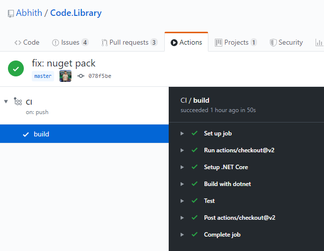
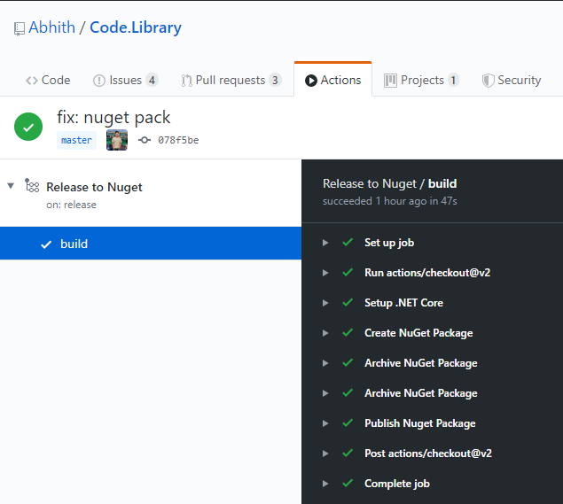
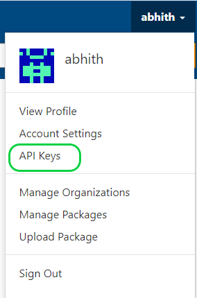

I always likes to automate the repeatative part of my work. At work, Azure DevOps taking care of the most of the CI & CD. I do maintain a small Class Library project in GitHub which has some helpers and stuffs you know like we reuse on most projects. And is been published to NuGet so that it can be consumed easily.

Recently I added one more project to the same repo which has some common stuff for ASP.NET Core projects. Previously I used to manually upload the .nuget pack file to NuGet since the releases were not that frequent. But now, the number of projects doubled, and sometime we need to deploy both packages since the ASP.NET Core project depends on the other library. So I did automated the whole process using GitHub actions. Here is how I did that,

You can check my repo where you can find the **GitHub Actions** configuration `yml` files under the `.github/workflows/` directory.

:point_right: [Abhith/Code.Library](https://github.com/Abhith/Code.Library)

I have two actions,

1. CI
2. Release to NuGet

## CI

The CI (Continuous Integration) action basically runs on every commit to the **master** branch as well as for every PR to master.

And the jobs are pretty self-explanatory,

- Setting up dotnet on the Linux
- Builds the solution file
- Run tests

```yml
# This is a basic workflow to help you get started with Actions

name: CI

# Controls when the action will run. Triggers the workflow on push or pull request
# events but only for the master branch
on:
  push:
    branches: [master]
  pull_request:
    branches: [master]

# A workflow run is made up of one or more jobs that can run sequentially or in parallel
jobs:
  # This workflow contains a single job called "build"
  build:
    # The type of runner that the job will run on
    runs-on: ubuntu-latest

    # Steps represent a sequence of tasks that will be executed as part of the job
    steps:
      - uses: actions/checkout@v2
      - name: Setup .NET Core
        uses: actions/setup-dotnet@v1
        with:
          dotnet-version: 3.1.101
      - name: Build with dotnet
        run: dotnet build --configuration Release
        working-directory: ./src
      - name: Test
        run: dotnet test
        working-directory: ./src
```



## Release to NuGet

This action runs on every new release. And the jobs include,

- Setting up dotnet on the Linux
- Create the .nupkg files
- Uploads artifacts
- Upload the Nuget packages

```yml
# This is a basic workflow to help you get started with Actions

name: Release to NuGet

# Controls when the action will run. Triggers the workflow on push or pull request
# events but only for the master branch
on:
  release:
    types: [published]

# A workflow run is made up of one or more jobs that can run sequentially or in parallel
jobs:
  # This workflow contains a single job called "build"
  build:
    # The type of runner that the job will run on
    runs-on: ubuntu-latest

    # Steps represent a sequence of tasks that will be executed as part of the job
    steps:
      - uses: actions/checkout@v2
      - name: Setup .NET Core
        uses: actions/setup-dotnet@v1
        with:
          dotnet-version: 3.1.101
      - name: Create NuGet Package
        run: dotnet pack -c Release /p:Version=${{ github.event.release.tag_name }} /p:PackageReleaseNotes="See https://github.com/Abhith/Code.Library/releases/tag/${{ github.event.release.tag_name }}"
        working-directory: ./src
      - name: Archive NuGet Package
        uses: actions/upload-artifact@v1
        with:
          name: Code.Library
          path: ./src/Code.Library/bin/Release/Code.Library.${{ github.event.release.tag_name }}.nupkg
      - name: Archive NuGet Package
        uses: actions/upload-artifact@v1
        with:
          name: Code.Library.AspNetCore
          path: ./src/Code.Library.AspNetCore/bin/Release/Code.Library.AspNetCore.${{ github.event.release.tag_name }}.nupkg
      - name: Publish Nuget Package
        run: dotnet nuget push **/*.nupkg --api-key ${{ secrets.nuget_api_key }} --source https://api.nuget.org/v3/index.json --no-symbols true
```



You can see that I am pushing 2 NuGet packages and both have the same version number, which is same as my release tag on GitHub.

During **Create NuGet Package** stage, initially it was failing with following error

```
.dll' to be packed was not found on disk
```

This was because, in one of the project, it had following Settings in the .csproj file

```xml
<GeneratePackageOnBuild>true</GeneratePackageOnBuild>
```

Once I removed the above, everything went well. You can see a similar issue posted [here](https://github.com/dotnet/sdk/issues/10335).

And the "Publish NuGet Package" job requires an API key from NuGet. You can get the API key from NuGet by logging into your NuGet account, create a new API key.



And I stored the key under my repo secrets.

### Manage Secrets in GitHub Repository

To manage secrets, on your repo go to the "Settings" tab, under that "Secrets". There I added a secret with name "nuget_api_key" and we can access those secrets inside actions like `${{ secrets.nuget_api_key }}`.
