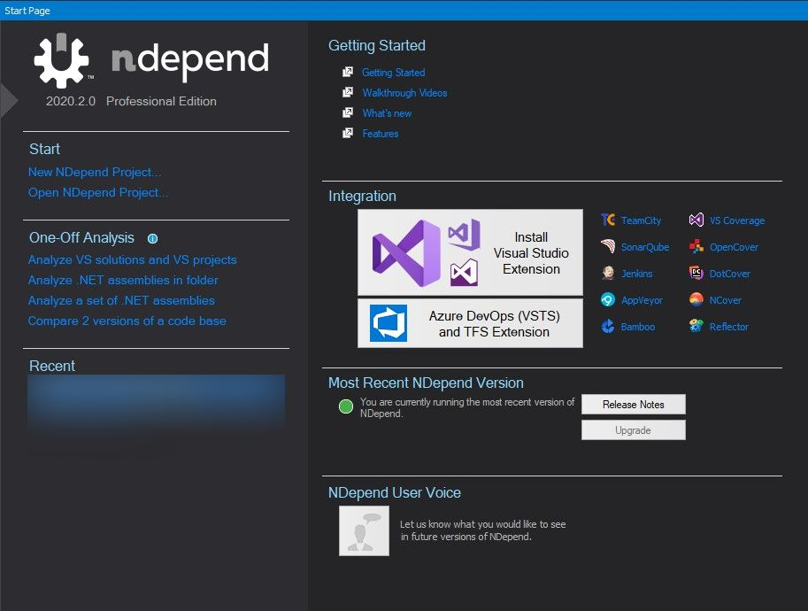
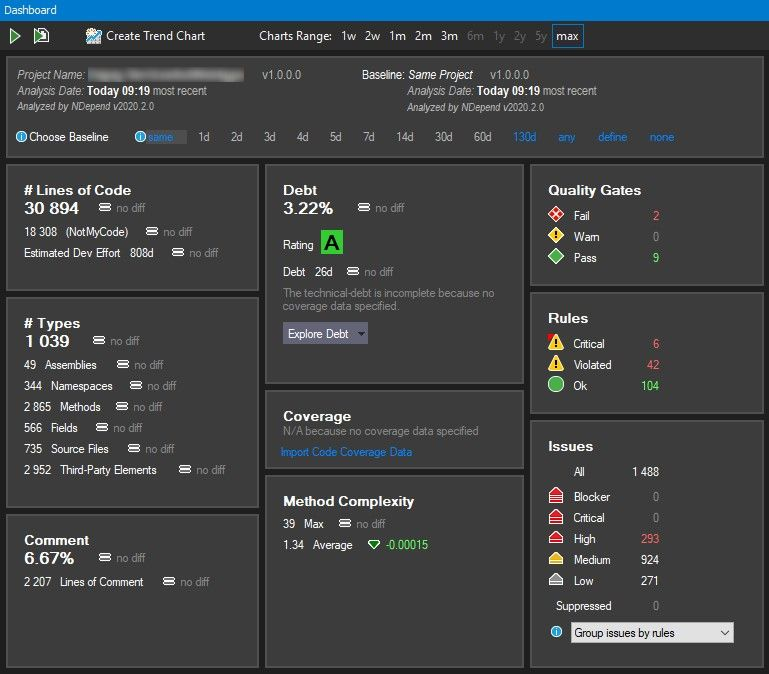
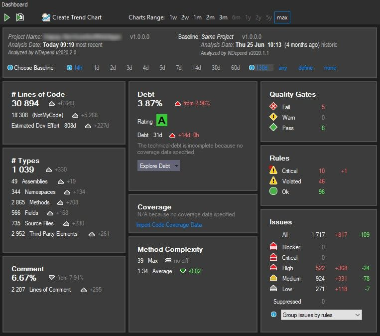
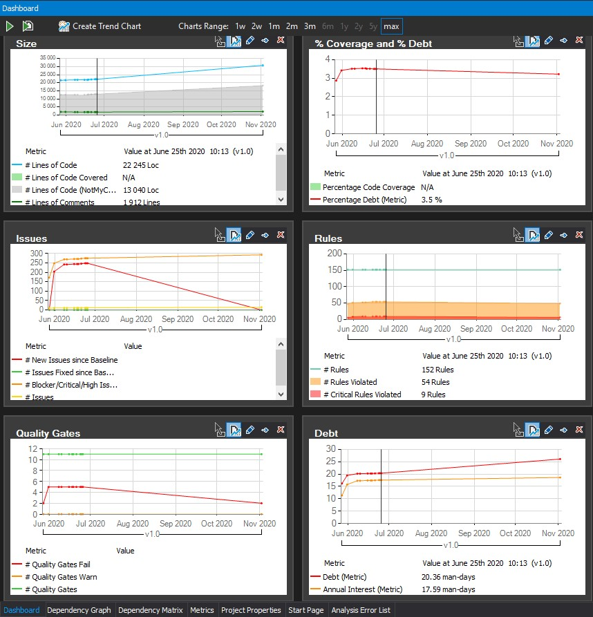
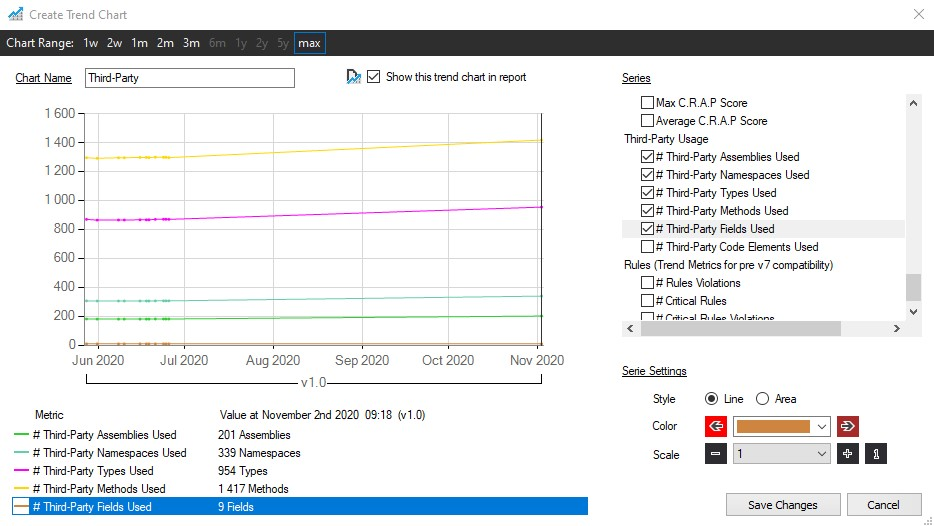

I love metrics and staring at them is one of my hobby. [NDepend][1] is the best in class static code analyser for dotnet.

When I tried [NDepend][1] the first time, it was overwhelming, the amount of information it throws out after analysis was too much. Still am exploring many sides of the information it shares.

## Initial Setup

Once you download the package, getting started is easy. Run the app and its Start page got everything you need to get started,

In my case, I installed the visual studio extension. With the Visual studio extension, you can easily attach new or existing NDepend project with the opened solution.

Eh, what is an NDepend project?

This is clearly mentioned in their getting started docs.

:point_right: [Getting Started with NDepend](https://www.ndepend.com/docs/getting-started-with-ndepend)

- A NDepend project can be attached to several Visual Studio solutions.
- This is useful if you wish to analyze several .NET assemblies compiled with several Visual Studio solutions.
- A benefit will be the possibility to navigate across several Visual Studio solutions opened in several Visual Studio instances.

Once the initial setup is done, after the first analysis, you will be presented with the analysis report. And it will be part of its dashboard.

## Dashboard

I love the [NDepend][1] dashboard since it shows all the metrics in a nice way.

Want to check how the code evolved compared to a previous date?
Just choose the baseline to any previous analysis date.

Want some charts?

Here we go. Following are the default ones ready for you to see the trend.

Noticed the **Create Trend Chart**?

We can create more trend charts as per our needs and metrics can be selected from a categorized list. In which one category I like is the **Third-Party Usage**,

[1]: https://www.ndepend.com/
