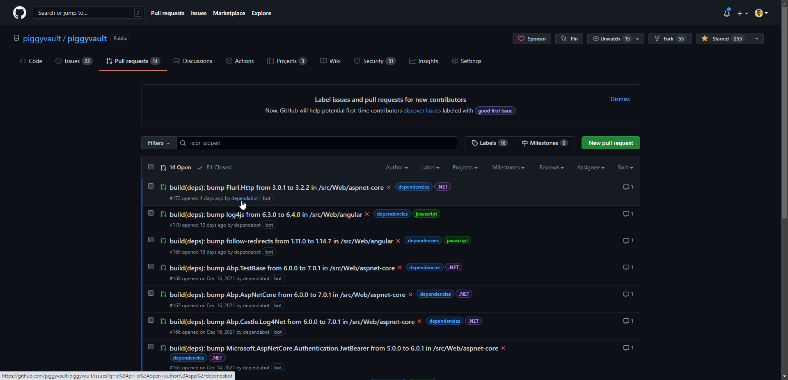
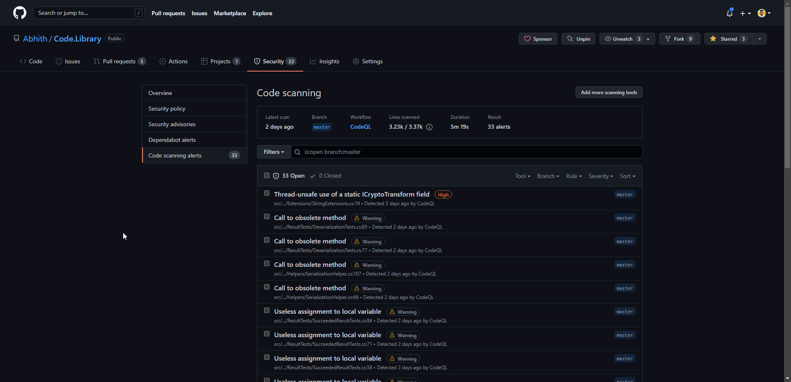

I have been using [Azure DevOps][2] as well as [GitHub][1] for many years now.
All open-source stuff is on GitHub (some private repositories too.), and all work stuff is on Azure DevOps.
I love [Azure DevOps][2], but for **code** management, I prefer using [GitHub][1] instead.

Since both are owned by **Microsoft**, and seeing the recent developments and features all happening on the GitHub side compared to Azure DevOps, my mind is pretty clear on which to choose for the future.
It's not just me, but many people agree on the same.
Jump to the [40:20](https://www.youtube.com/watch?v=K5aO97x2208&t=2420s) on the below video and hear yourself.

`youtube: https://www.youtube.com/watch?v=K5aO97x2208&start=2420s`

So, I would like to see this change (move all our repo to GitHub) in my organization.
Currently, we use Azure DevOps for both code & CI/CD pipelines.

Since it is an organization-wide change, I cannot just go and tell my manager about this change.
Instead, I have to present what benefits we are getting through this change.

For that, I thought of creating an internal presentation and side-by-side this public blog.

So in this post, I will try to list out things that attract me towards GitHub for code management.

## Dependabot

_Automated dependency updates built into GitHub._

One of the main attracting factors towards GitHub.
Since we have many projects and tracking all the dependencies manually is not possible at all.

:point_right: [Keep all your packages up to date with Dependabot](https://github.blog/2020-06-01-keep-all-your-packages-up-to-date-with-dependabot/)

**Dependabot**'s automated PRs with updated packages/dependencies help a lot.

And the security alerts,

## Code Scanning

[Code scanning](https://resources.github.com/code-scanning/) is GitHub’s native SAST (Static Application Security Testing) tool, a developer-first approach to SAST that enables vulnerabilities to be found and remediated effortlessly before they reach production.

Here’s what GitHub code scanning can help you do:

- Find, triage, and prioritize vulnerabilities in your code.
- See security issues in your pull requests as part of your review process.
- Prevent new vulnerabilities from making it to production.
- Schedule scans for specific days and times, or trigger scans when a specific event occurs in the repository, such as a push.

The [CodeQL](https://codeql.github.com/) action part of the code scanning features of GitHub is good even though comes at a price (of course free for open source).
And I prefer the `security-and-quality` query suite for the `CodeQL`.

## Marketplace and integrations

Both Azure DevOps and GitHub have many integrations available.
But IMHO, GitHub has a better collection, growing too.

### JIRA

We manage our work items through [Jira][3]. One of the main things we are missing in Azure DevOps is the Jira integration whereas there's an official integration available between JIRA and GitHub.

Linking work items to code have many benefits.

GitHub issues, boards all are awesome but JIRA is a bit more advanced as well as customizable for software project management, so can't ask to switch to GitHub at this time (still I prefer GitHub).

## GitHub Checks

There are several GitHub apps which is capable of running powerful checks against the code changes in the repository.
Apps that perform continuous integration, code linting, or code scanning services and provide detailed feedback on commits.

## Release Notes

The GitHub releases are a great way to share the latest version of your code.
The **release notes** associated with the release are a great way to share the changes in the code.

Do you know that GitHub can help in making release notes?

Having the release notes part of each release, and helping with making the release notes is another plus side of Github.

## Azure Pipelines vs GitHub Actions

Azure Pipelines are way matured compared to GitHub Actions (:point_left: this may change in the future).

But yes, a complete switch to GitHub from Azure DevOps might be possible by replacing Azure DevOps pipelines with GitHub actions.
But people mostly hate change when things are working fine with the current setup.
So one step at a time in terms of change.

i.e First code migration, then slowly pipelines.
The first candidate for GitHub Actions can be PR builds.

While comparing both, I love the following facts about the GitHub action,

- Easy to create by just placing the workflow file in the `.github/workflows` directory. Whereas Azure DevOps requires you to create a new pipeline in the UI.
- Suggestions for the workflow file are provided in the GitHub action UI based on your project’s type.

## Mobile Application

GitHub’s mobile application is a great way to manage your code.

- You can do PR review,
- Merge code,
- And so on,

All through the mobile app.

Azure DevOps doesn't have such a mobile application but you can access the DevOps portal through the mobile browser, the UI is somewhat responsive, but the experience is still way better in GitHub’s mobile app, and the app is getting new features on every release.

## Powerful web-based editor (VS Code on Web)

https://twitter.com/abhithrajan/status/1504864768389222404

The [github.dev](https://github.dev) and the shortcut ".", 👌. I am using it more often, even this blog am maintaining most of the time via the web editor of GitHub.

## And

- PR review is much better on GitHub. The sticky checkbox on each file is way better than the sidebar static checkboxes in the Azure DevOps.
- The GitHub organization landing page with repositories sorted by last updated gives a better insight to the team.
- The total number of repositories indicator in GitHub is a good metric, not sure how to find the total number of repositories in the Azure DevOps organization since repositories are kept under projects in the Azure DevOps organization.
- The GitHub community. You can follow external projects, and people and can learn from them.  

## Pricing

Looks complicated on GitHub. In most places, it is like `Contact Sales`.
The change would be an easier task if the billing could be done through an Azure Subscription but it looks like it is not possible at the moment.

Anyway, the free plan offers enough feature sets to start with GitHub.

---

If you plan to migrate to GitHub, the following sections will help you.

## Code Migration From Azure DevOps to GitHub

The code repository migration from Azure DevOps to GitHub is pretty easy.

- Import repository
  
- Give your Azure DevOps Repo URL, and fill in the rest.
- And on the next screen, it will ask for credentials to access your DevOps repo. `Git credentials` for the Azure DevOps repo will work fine. You can generate that one on the clone window on Azure DevOps as shown below.
  

That's it. You will not miss any code history after migration.

## Change Azure Pipeline Repository From Azure DevOps to GitHub

Since in our case, we have all pipelines already configured in the DevOps.
And don't want to change any of them other than the repository location.
This can be done by following the below steps.

- Edit the existing pipeline
- In the upper right corner open the ... menu
- Pick the ⚡ Triggers option
- Click the YAML tab
- Click the Get Sources option
- Reconfigure the source repo to GitHub.

You might need to choose a `GitHub connection` to pick the repo.
For that, better to install the [Azure Pipelines](https://github.com/marketplace/azure-pipelines) GitHub app and give it access to the repository.
Which will create a connection back to your Azure DevOps account.

## Final Notes

After reading this,

- Are you convinced that GitHub is better compared to Azure DevOps for code?
- If you are a GitHub pro, did I miss any goodness of GitHub over Azure DevOps in terms of code management?

Let me know in the comments below :point_down:

## Additional Resources

- [Azure DevOps vs GitHub: Comparing Microsoft's DevOps Tools](https://acloudguru.com/blog/engineering/azure-devops-vs-github-comparing-microsofts-devops-twins)
- [Azure DevOps vs GitHub | UpGuard](https://www.upguard.com/blog/microsoft-visual-studio-team-services-vs-github)

---

## Changelog

### 2022-07-20

- Added the **Powerful web-based editor** section

### 2022-07-13

- Added the **And** section

### 2022-06-07

- Added **Release Notes** and **Mobile Application** sections.
- Updated **Azure Pipelines vs GitHub Actions** section.

---

https://twitter.com/AbhithRajan/status/1488579218971807756

[1]: /topics/github/
[2]: /topics/azure-devops/
[3]: /topics/jira/
