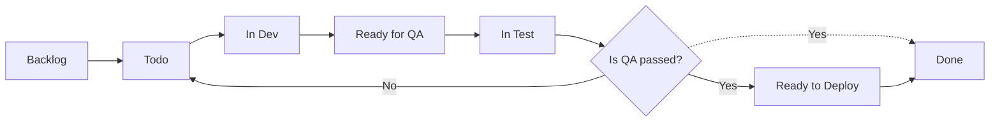

We use [Jira](/topics/jira/) for our issue/task management at work. As a DevOps guy, one of my favorite features of Jira is Jira automation.

For automation starters, the good thing is there are many predefined templates available at the [Jira automation template library](https://www.atlassian.com/software/jira/automation-template-library), which we can use as a reference to create our own with adaptations as per our needs.

Before getting into the automation rules which we use, to get a better picture, better to know about our current workflow.

## Workflow

Our current workflow is,

And, we configured our Jira to have the following two custom fields for issue types, which are,

- Developer
- Tester

Both of them are of the type `User Picker (single user)`.

This is to retain the developer, and tester information on the issue since the assignee may change during state transition as per the workflow.

Now, let's jump into the automation rules which we use. They are,

## Automation rules

1. Auto-assign to whoever created the issue
2. Close duplicate issues
3. Link issues that are mentioned in the comments
4. When a commit is created and the status is 'To do' → then transition this issue to 'In Dev'
5. On Pull Request created → comment the details
6. On Pull Request merged → comment the details
7. Comment on Ready for QA items if not assigned to a QA
8. Assign issue back to Developer once Ready To Deploy
9. Assign issue back to Developer once Done
10. When issue is resolved → comment on related issues
11. Label issues as stale that have not had recent interaction

I hope the names are self-explanatory. Now let's dig into each and will try to explain the use case for each,

### 1. Auto-assign to whoever created the issue

This is very simple automation. When an issue is created **without an assignee**, automatically assign it to the person who created it.

This ensures that someone is always accountable for an issue by making sure it is always assigned to whoever created it.

And the result will be,

There's a template for the same in the Jira automation template library.

:point_right: [Smart auto-assign](https://www.atlassian.com/software/jira/automation-template-library/rules#/rule/1381434)

### 2. Close duplicate issues

Sometimes, we have multiple similar issues. We can close the second issue and keep the first issue open just by adding a link to the second issue as,

> The second issue `duplicates` the first issue.

The automation rule for closing such duplicate is,

That will do,

### 3. Link issues that are mentioned in the comments

This will help us to link issues that are mentioned in the comments. And, along with the automation rule **When issue is resolved → comment on related issues**, this is a great way of notifying the related issues and the watchers of the same.

The result is,

### 4. When a commit is created and the status is 'To do' → then transition this issue to 'In Dev'

We already connected our **GitHub** repos to our JIRA cloud.
And, this automation will help us to transition the issue to 'In Dev' when a commit is created in Github.

You can use the smart commit message to trigger this automation.

:point_right: [Process issues with smart commits | Jira Software Cloud | Atlassian Support](https://support.atlassian.com/jira-software-cloud/docs/process-issues-with-smart-commits/)

That's it, automation will take care of the issue transition,

### 5. On Pull Request created → comment the details

This is to comment on the issue about the details of the pull request so the watchers are informed that there's some progress on the work item.

Then automation will do,

### 6. On Pull Request merged → comment the details

Similar to **On Pull Request created → comment the details**, this is to comment the details of the pull request on the issue so the watchers are informed that there is more progress on the work item.

Then automation will do,

### 7. Comment on Ready for QA items if not assigned to a QA

As per our workflow, the dev should assign the task to a QA person when the task is ready for QA.
But, if the dev doesn't assign the task to a QA person, then automation comments on the issue to alert the dev person.

That's it, automation will notify the developer in case they forgot to assign the task to a QA person.

### 8. Assign issue back to Developer once Ready To Deploy

Once the QA passed, the QA person should assign the task back to the developer of that work item along with changing the status to **Ready to Deploy**. But, we observed that most time the QA person forgets to assign the task back to the dev.
To avoid this, we are using this automation rule to assign the task back to the dev once the task is ready to deploy.

Now automation will take care of the assignee switching,

### 9. Assign issue back to Developer once Done

This is similar to **Assign issue back to Developer once Ready To Deploy**, but this is to assign the task back to the dev once the task is done.

That is because, once QA passed, QA can either mark it as **Done** or **Ready to Deploy**.

### 10. When issue is resolved → comment on related issues

As I mentioned in the automation rule **3. Link issues that are mentioned in the comments**, this is a great way of notifying the related issues and the watchers of the same.

This rule does,

### 11. Label issues as stale that have not had recent interaction

After a period of inactivity (now set to 60d), a stale label will be applied to mark an issue with `Todo` status as **stale** and posts a comment to notify contributors that the issue will be closed.

Before adding this rule to the automation, I had around ~250 issues assigned to me in the Backlog. Most of them were created by myself since I have a habit of making notes of all work items in the Jira after any work-related discussions. But all of those were sitting there for so long whereas our priorities were wholly different and some were too old and stale of course. And, we recently started to work based on the backlog items so having a long backlog with stale work items is not a good thing and it was hard to prioritize the work too.

So, I decided to add this rule to the automation and it labeled the stale issues.

Then I went around all my stale issues, closed the ones which were not relevant anymore, and the ones which are not stale simply removed the stale label. In the end, I ended up having around ~50 items in the backlog.
So, picking up items for the next sprint was easy and I was able to prioritize the backlog items.

#### Is closing stale issues really a good idea?

In any successful software project, there's always more work to do than people to do it. As more and more work piles up, it becomes paralyzing. Just making decisions about what work should and shouldn't get done can exhaust all available resources.

Focusing on issues that are actively affecting humans is an effective method for prioritizing work.

To some, a robot trying to close stale issues may seem inhospitable or offensive to contributors. But the alternative is to disrespect them by setting false expectations and implicitly ignoring their work. This automation makes it explicit: if work is not progressing, then it's stale. A comment is all it takes to keep the conversation alive.

## Planned Improvements

- Rule to auto-assign to the tester when transitioned to **Ready for QA**
- Rule to auto-assign to the developer when transitioned to **Todo** from **In Test** (QA not passed case)
- Close issues that are marked as stale, after a period of inactivity.

## Final Thoughts

The Jira automation helps us to manage the work items more efficiently and we are loving it.
If you have any questions related to any of the Jira automation rules, or if you have any suggestions, please feel free to post them in the comments :point_down:

## Additional Resources

- [Most popular Jira automation templates | Atlassian](https://www.atlassian.com/software/jira/automation-template-library/most-popular)

---

https://twitter.com/AbhithRajan/status/1513555118817435657
