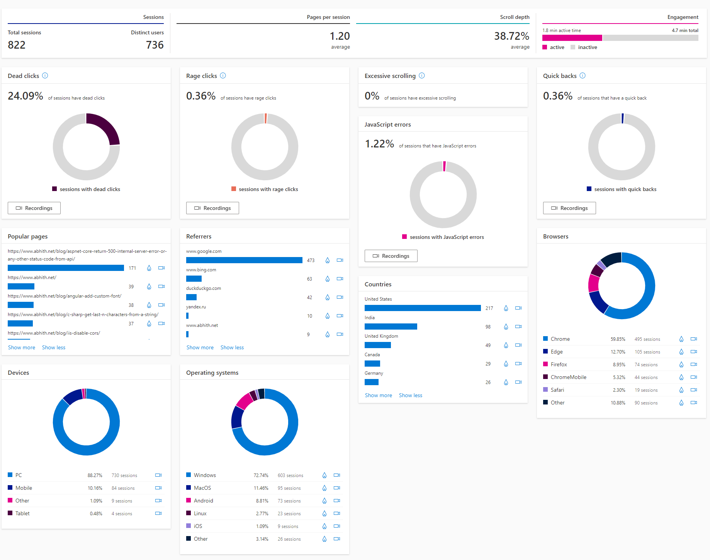
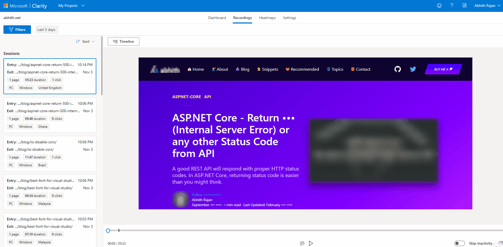
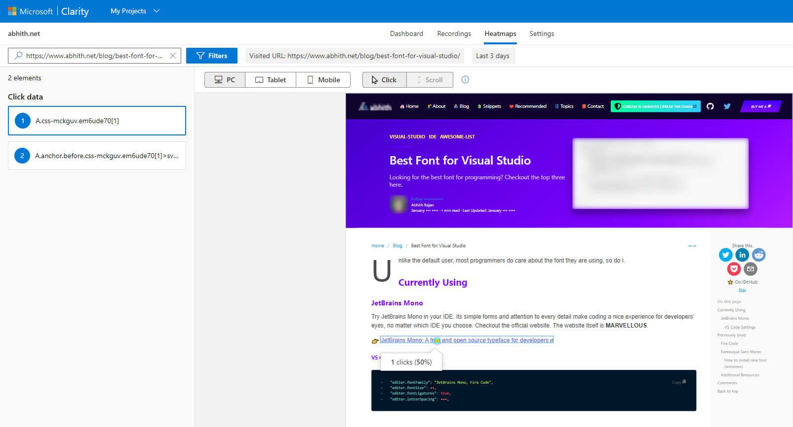

I'm impressed. From a long-term **Google Analytics** user point, **Clarity** provides more info about the actual user interactions on the website.

Getting started was pretty easy.

- Sign-up [here](https://clarity.microsoft.com/), it's **FREE**.
- Create a Clarity project for your website.
- Integrate with your website.

There are already some direct integrations available. In my case, I have opted for the `Install tracking code manually`.

## Integrating Microsoft Clarity with GatsbyJS website

It is very similar to adding **Google AdSense** as described in my older post here,

:point_right: [GatsbyJS - Add Google AdSense](https://www.abhith.net/blog/gatsbyjs-add-google-adsense/)

All you have to do is, update your `gatsby-ssr.js` with the below code (if there is no `gatsby-ssr.js` file on your project directory then create one at the root).

```js
import React from "react";

export const onRenderBody = ({ setHeadComponents, setPostBodyComponents }) => {
  const pluginOptions = {
    head: true,
  };
  if (process.env.NODE_ENV !== `production`) {
    return null;
  }

  const setComponents = pluginOptions.head
    ? setHeadComponents
    : setPostBodyComponents;
  return setComponents([
    <script
      async
      type="text/javascript"
      dangerouslySetInnerHTML={{
        __html: `
      (function(c,l,a,r,i,t,y){
        c[a]=c[a]||function(){(c[a].q=c[a].q||[]).push(arguments)};
        t=l.createElement(r);t.async=1;t.src="https://www.clarity.ms/tag/"+i;
        y=l.getElementsByTagName(r)[0];y.parentNode.insertBefore(t,y);
    })(window, document, "clarity", "script", "<YOUR-CLARITY-PROJECT-ID>");
      `,
      }}
    />,
  ]);
};
```

Replace `<YOUR-CLARITY-PROJECT-ID>` with your CLARITY project ID.
The embedded script you can view at `Clarity Project > Settings > Setup > Install tracking code manually`.

**onRenderBody** is a Gatsby SSR API, called after every page Gatsby server renders while building HTML so you can set head and body components to be rendered in your html.js.

:point_right: [SSR APIs | GatsbyJS](https://www.gatsbyjs.org/docs/ssr-apis/#onRenderBody)

Build the project (`gatsby build`) and see whether the AdSense snippet is present in the build output HTML (`gatsby serve`).

You can also refer to the same used in my repo itself.

:point_right: [Abhith/abhith.net](https://github.com/Abhith/abhith.net/blob/master/gatsby-ssr.js)

---

Once you have done the integrations and if the site is live, after a few minutes you will start seeing the metrics getting populated in the **Clarity Dashboard**.

## Dashboard

It is pretty clean and minimal. And it looks like,



## Recordings

It's a dope feature. Exactly what each user did, like actual screencast of user interactions on that page with clicks and all. There is a sound indication for mouse clicks as well, Nice.



This will also help website owners to understand the dropout behaviors of users easily.

Also, sensitive data masking and other privacy concern are taken care of by **Clarity** automatically.

## Heatmaps

As the name suggests, most interacted areas will be visualized here.



_Note: This review is done after a couple of hours of integrating Microsoft Clarity with the website hence the data collected is minimal at this stage._

If you are concerned about the data it collects, privacy, etc, one fact is that it is an opensource project. So you can have a look at it,

:point_right: [GitHub-microsoft/clarity](https://github.com/microsoft/clarity)

I'm impressed with **Microsoft Clarity**. Try it out and see how can you make use of it.

## Additional Resources

- [Clarity Documentation](https://docs.microsoft.com/en-us/clarity/)
