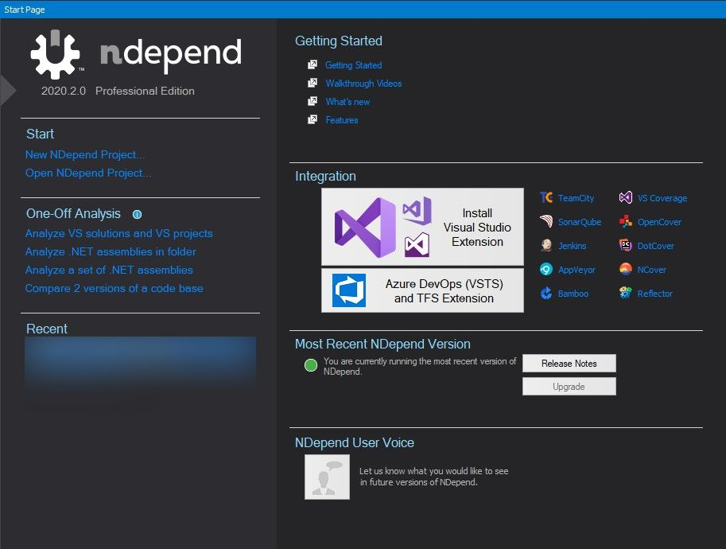

If you check my [about](/about/) page, I have mentioned that,

> My role involves prototyping, developing backend as well as front end apps with modern workflows, frameworks. **Keeping an eye on the patterns and organized code.**

To keep the code organized and to make sure the quality is met, I depend on [NDepend][1].

[NDepend][1] is the best-in-class static code analyzer for [dotnet](/topics/dotnet/). And the best come with a price too, i.e it's a PAID tool. [Someone](https://www.linkedin.com/in/patrick-smacchia-b0123110/) was kind enough to send me a licensed version.

When I tried [NDepend][1] the first time, it was overwhelming, the amount of information it throws out after analysis was too much 😲.
Still am exploring many sides of the information it shares. In this post, I will share how I use it and the areas where it helps.

## Initial Setup

Once you download the package, getting started is easy. Run the app and its Start page got everything you need to get started,

In my case, I installed the visual studio extension. With that, you can easily attach a new or existing **NDepend project** with the opened solution.

Eh, what is an NDepend project?

This is mentioned in their getting started docs.

:point_right: [Getting Started with NDepend](https://www.ndepend.com/docs/getting-started-with-ndepend)

- A NDepend project can be attached to several Visual Studio solutions.
- This is useful if you wish to analyze several .NET assemblies compiled with several Visual Studio solutions.
- A benefit will be the possibility to navigate across several Visual Studio solutions opened in several Visual Studio instances.

Once the initial setup and first analysis of the project are done, you will be presented with the analysis report. And it will be part of its dashboard.

## Dashboard

I love metrics and staring at them is one of my hobbies. So do I love the [NDepend][1] dashboard since it shows all the metrics nicely.

Want to check how the code evolved compared to a previous date?
Just choose the baseline to any previous analysis date.

Want some charts?

Here we go. Following are the default ones ready for you to see the trend.

Noticed the **Create Trend Chart**?

We can create more trend charts as per our needs and metrics can be selected from a categorized list. In which one category I like is the **Third-Party Usage**,

So far, I just scratched the surface of the [Ndepend][1] tool only. More about it is on the way.

In the meantime check out these great articles about [NDepend][1], which share a lot (really, a lot) about its features.

- [NDepend: Static Analysis For Software Architects - Review | tomassetti.me](https://tomassetti.me/ndepend/)
- [NDepend - A Complete Static Code Analysis Tool | c-sharpcorner.com](https://www.c-sharpcorner.com/article/ndepend-a-complete-static-code-analysis-tool/)
- [NDepend code analysis | dev.to](https://dev.to/chris_mckelt/ndepend-code-analysis-415a)
- [Tracking .NET Code Quality with NDepend - Kill All Defects](https://killalldefects.com/2019/11/02/tracking-dotnet-code-quality-with-ndepend/)
- [Code Quality with NDepend tool — .NET Core](https://medium.com/@alexandre.malavasi/code-quality-with-ndepend-tool-net-core-854ec070b47d)
- [Integrate NDepend 2020 into your .NET Core projects – Anthony Giretti's .NET blog](https://anthonygiretti.com/2020/05/09/integrate-ndepend-2020-into-your-net-core-projects/)
- [It NDepends! Part 3: New dependency graph in NDepend 2020.1](https://surfingthecode.com/it-ndepends-part-3-new-dependency-graph-in-ndepend-2020.1/)

[1]: https://www.ndepend.com/
