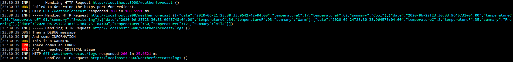
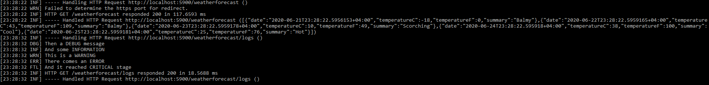
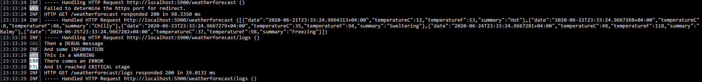
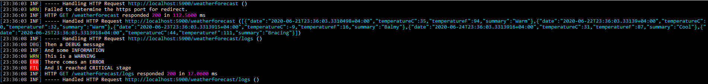
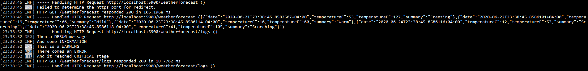
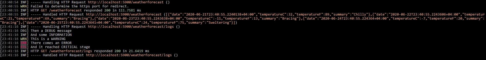

Serilog is my favorite logger. The sinks I was using are ApplicationInsights, File, and Seq (for local). I was not using **Console** sink but when we switched to `docker`, I thought it is nice to have **Console** too.

I was checking the colored output for **Console** and I realized that the `serilog-sinks-coloredconsole` is retired and the `Serilog.Sinks.Console` by default has the colored output. There were few color themes listed on the [readme](https://github.com/serilog/serilog-sinks-console) so I want to see how each looks like, and see it for yourself below.

## Built-in Themes

### SystemConsoleTheme.Literate (Default)

```cs
.WriteTo.Console()
```

OR

```cs
.WriteTo.Console(theme: SystemConsoleTheme.Literate)
```



### ConsoleTheme.None

```cs
.WriteTo.Console(theme: ConsoleTheme.None)
```



### SystemConsoleTheme.Grayscale

```cs
.WriteTo.Console(theme: SystemConsoleTheme.Grayscale)
```



### AnsiConsoleTheme.Literate

```cs
.WriteTo.Console(theme: AnsiConsoleTheme.Literate)
```



### AnsiConsoleTheme.Grayscale

```cs
.WriteTo.Console(theme: AnsiConsoleTheme.Grayscale)
```



### AnsiConsoleTheme.Code

```cs
.WriteTo.Console(theme: AnsiConsoleTheme.Code)
```



## Final Notes

In the above list, my favorite so far is the `default` one. I didn't try any custom themes yet. if you know any good looking custom themes, let me know in the comments :point_down:

## Additional Resources

- [serilog/serilog-sinks-console](https://github.com/serilog/serilog-sinks-console)
